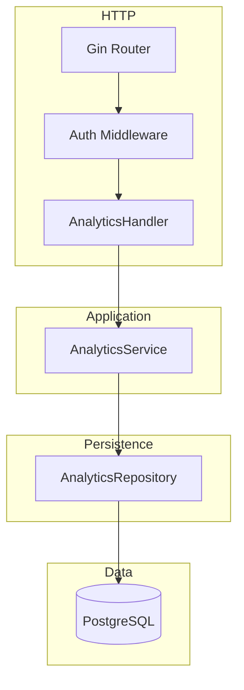
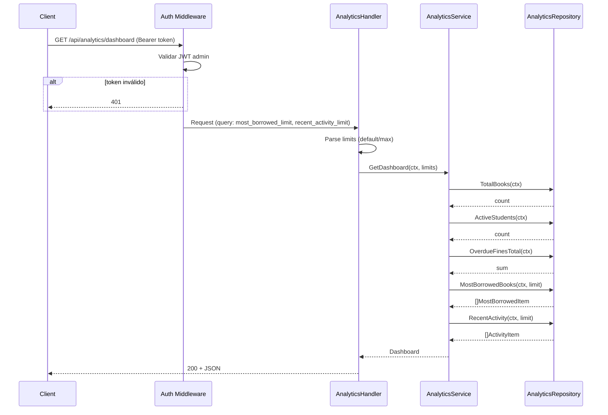

# Overview

Módulo de analíticas (dashboard) en Go con Gin y PostgreSQL. Arquitectura en capas: **handlers** → **services** → **repositories**. Solo lectura: un **AnalyticsRepository** (o métodos en repos existentes) ejecuta consultas agregadas sobre `books`, `students`, `fines`, `loans` y `activity_log`. Un **AnalyticsService** orquesta las llamadas y un **AnalyticsHandler** expone un único endpoint GET protegido con JWT (rol admin). Respuesta JSON con total_books, active_students, overdue_fines, most_borrowed_books (top N) y recent_activity (últimos N). Sin escritura en BD. Validación de query params (limit) con valores por defecto y máximo.

# Architecture

## Diagrama de componentes



## Diagrama de secuencia – GET dashboard



# Components and Interfaces

## Stack

Mismo que el proyecto: Gin, JWT middleware (admin), pgx o database/sql, arquitectura en capas.

## Contratos API

| Método | Ruta | Descripción | Query params | Respuestas |
|--------|------|-------------|--------------|------------|
| GET | `/api/analytics/dashboard` | Dashboard con las cinco métricas | `most_borrowed_limit` (default 5, max 20), `recent_activity_limit` (default 10, max 50) | 200, 401, 500 |

**Query params (opcionales):**

- `most_borrowed_limit`: número entero; default 5, máximo 20. Cantidad de libros en "most borrowed".
- `recent_activity_limit`: número entero; default 10, máximo 50. Cantidad de eventos en "recent activity".

## DTOs (respuesta)

```go
// DashboardResponse — respuesta completa del dashboard
type DashboardResponse struct {
    TotalBooks         int64                `json:"total_books"`
    ActiveStudents     int64                `json:"active_students"`
    OverdueFines       float64              `json:"overdue_fines"` // 2 decimales
    MostBorrowedBooks []MostBorrowedItem    `json:"most_borrowed_books"`
    RecentActivity     []RecentActivityItem `json:"recent_activity"`
}

// MostBorrowedItem — un libro del top "más prestados"
type MostBorrowedItem struct {
    BookID       string   `json:"book_id"`
    Title        string   `json:"title"`
    CatalogCode  string   `json:"catalog_code"`
    BorrowCount  int64    `json:"borrow_count"`
    AuthorNames  []string `json:"author_names,omitempty"` // opcional, desde book_authors + authors
}

// RecentActivityItem — una entrada de activity_log
type RecentActivityItem struct {
    ID          string            `json:"id"`
    EventType   string            `json:"event_type"`
    Title       string            `json:"title"`
    Description string            `json:"description,omitempty"`
    Metadata    map[string]any    `json:"metadata,omitempty"`
    CreatedAt   time.Time         `json:"created_at"`
    ActorName   string            `json:"actor_name,omitempty"`   // opcional, desde users
    StudentName string            `json:"student_name,omitempty"` // opcional, desde students
}
```

## Interfaces de dominio

```go
// DashboardLimits — límites para listas del dashboard
type DashboardLimits struct {
    MostBorrowedLimit  int // default 5, max 20
    RecentActivityLimit int // default 10, max 50
}

// AnalyticsRepository
type AnalyticsRepository interface {
    TotalBooks(ctx context.Context) (int64, error)
    ActiveStudents(ctx context.Context) (int64, error)
    OverdueFinesTotal(ctx context.Context) (float64, error)
    MostBorrowedBooks(ctx context.Context, limit int) ([]MostBorrowedItem, error)
    RecentActivity(ctx context.Context, limit int) ([]RecentActivityItem, error)
}

// AnalyticsService
type AnalyticsService interface {
    GetDashboard(ctx context.Context, limits DashboardLimits) (*DashboardResponse, error)
}
```

No se definen errores de dominio específicos para “no encontrado” porque las consultas son agregados; solo errores de infraestructura (ej. contexto cancelado, BD no disponible), que se traducen a 500.

# Data Models

## Consultas SQL (referencia)

Las siguientes consultas se ejecutan en el repositorio contra el esquema existente (`migrations/001_initial_schema.sql`).

**Total books:**  
`SELECT COUNT(*) FROM books`

**Active students:**  
`SELECT COUNT(*) FROM students WHERE is_active = true`

**Overdue fines total:**  
`SELECT COALESCE(SUM(amount), 0) FROM fines WHERE status = 'pending'`

**Most borrowed books (top N):**  
Contar préstamos por libro y ordenar descendente; devolver título, catalog_code y opcionalmente autores. Ejemplo (sin autores):

```sql
SELECT b.id, b.title, b.catalog_code, COUNT(l.id) AS borrow_count
FROM books b
LEFT JOIN loans l ON l.book_id = b.id
GROUP BY b.id, b.title, b.catalog_code
ORDER BY borrow_count DESC
LIMIT $1;
```

Con autores requiere agregar join a `book_authors` y `authors` y agregación de nombres (ej. `array_agg(a.name)` o subconsulta).

**Recent activity (últimos N):**  
```sql
SELECT a.id, a.event_type, a.title, a.description, a.metadata, a.created_at,
       u.first_name || ' ' || u.last_name AS actor_name,
       s.first_name || ' ' || s.last_name AS student_name
FROM activity_log a
LEFT JOIN users u ON u.id = a.actor_id
LEFT JOIN students s ON s.id = a.student_id
ORDER BY a.created_at DESC
LIMIT $1;
```

## Entidades Go (solo lectura)

Los tipos `MostBorrowedItem` y `RecentActivityItem` se rellenan desde las filas de las consultas anteriores. No hay entidades de dominio con persistencia adicional; todo es proyección sobre tablas existentes.

# Correctness Properties

### Property 1: Total books no negativo

*For any* ejecución de TotalBooks, el valor devuelto SHALL ser >= 0.

**Validates:** Requirement 1.1

### Property 2: Active students no negativo

*For any* ejecución de ActiveStudents, el valor devuelto SHALL ser >= 0.

**Validates:** Requirement 2.1

### Property 3: Overdue fines no negativo

*For any* ejecución de OverdueFinesTotal, el valor devuelto SHALL ser >= 0 (COALESCE a 0 si no hay filas).

**Validates:** Requirement 3.1

### Property 4: Most borrowed ordenado y acotado

*For any* ejecución de MostBorrowedBooks con límite N, la lista SHALL tener como máximo N elementos y SHALL estar ordenada por borrow_count descendente.

**Validates:** Requirement 4.1, 4.2

### Property 5: Recent activity ordenada por fecha y acotada

*For any* ejecución de RecentActivity con límite N, la lista SHALL tener como máximo N elementos y SHALL estar ordenada por created_at descendente.

**Validates:** Requirement 5.1, 5.2

### Property 6: Sin token admin → 401

*For any* petición a GET /api/analytics/dashboard sin token válido de administrador, THE sistema SHALL responder 401.

**Validates:** Requirements 1.2, 2.2, 3.2, 4.3, 5.3, 6.3

# Error Handling

- **401:** Sin token o token inválido o rol no admin. Mensaje genérico ("No autorizado" o "Token inválido").
- **500:** Error de BD o interno. Mensaje genérico, log del error real; no exponer detalles al cliente.
- No se devuelve 404 para el dashboard (el recurso existe; puede devolver listas vacías para most_borrowed_books o recent_activity).

# Testing Strategy

- **Unit tests:** AnalyticsService con mock de AnalyticsRepository; verificar que GetDashboard devuelve un DashboardResponse con los cinco campos y que los límites se pasan correctamente al repositorio.
- **Repository tests:** AnalyticsRepository (integración con BD o testcontainers): TotalBooks, ActiveStudents, OverdueFinesTotal devuelven valores coherentes; MostBorrowedBooks con limit 5 devuelve ≤ 5 elementos ordenados por count; RecentActivity con limit 10 devuelve ≤ 10 elementos ordenados por created_at DESC.
- **Handler tests:** GET /api/analytics/dashboard con token admin → 200 y estructura JSON esperada; sin token → 401; query params most_borrowed_limit y recent_activity_limit se parsean y acotan a default/max.
- **Properties (opcional):** Property 4 y 5 (orden y cota de listas); Property 6 (401 sin admin).
