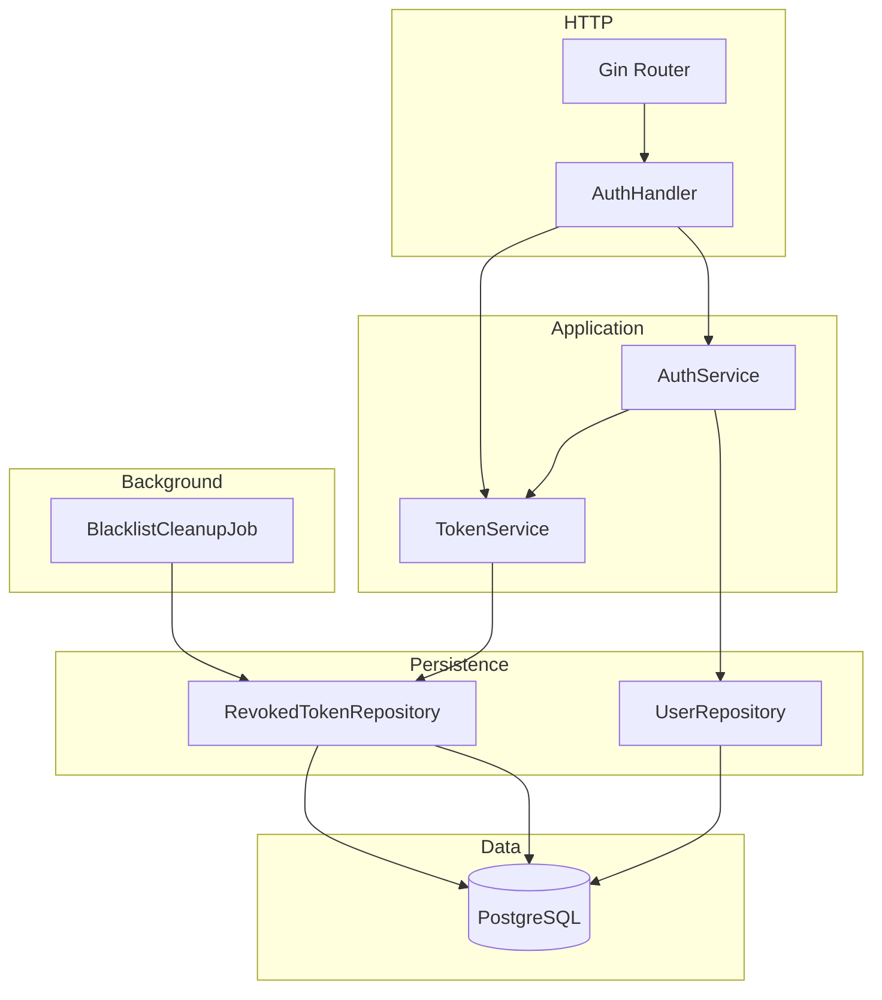
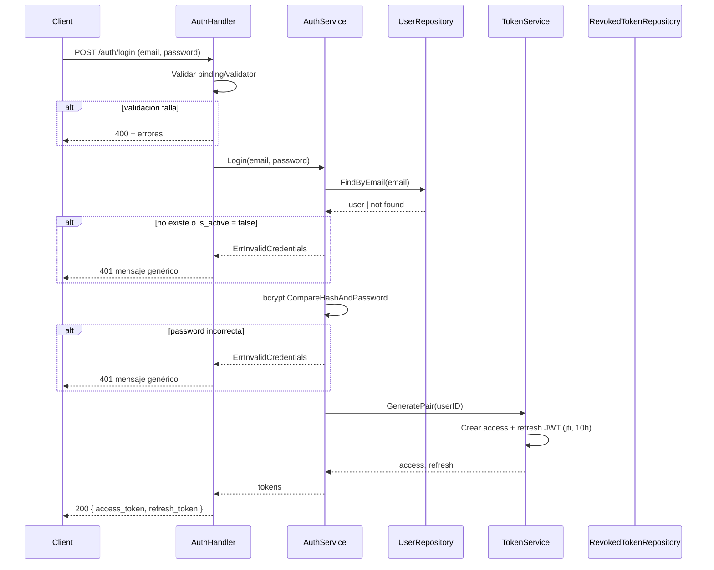
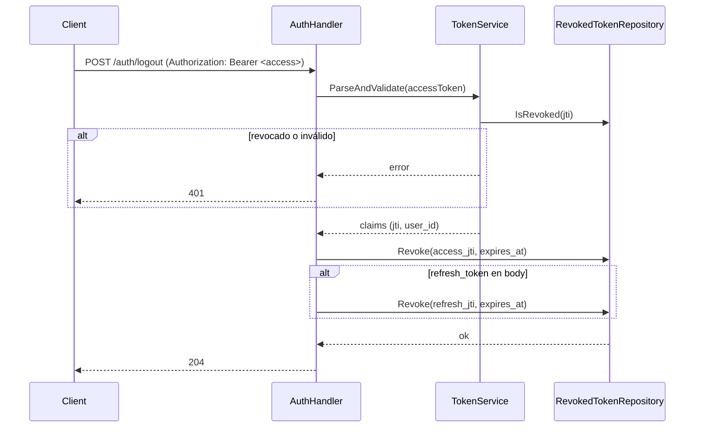

# Overview

Solución en Go con Gin en arquitectura en capas: **handlers** (HTTP) → **services** (lógica de negocio) → **repository** (PostgreSQL). Autenticación JWT (access + refresh, 10h TTL), blacklist de tokens en tabla `revoked_tokens` para logout, contraseñas con `golang.org/x/crypto/bcrypt`, validación con `go-playground/validator/v10`. Tabla `users` con campos `first_name`, `last_name`, `email`, `password_hash`, `role` (enum: admin/librarian), `avatar_url`, `is_active`. Un **cron** se ejecuta cada 2 días para limpiar la blacklist. Errores 400/401/409/500 con payloads estructurados y mensajes genéricos en respuestas sensibles.

# Architecture

## Diagrama de componentes



## Diagrama de secuencia – Login



## Diagrama de secuencia – Logout (blacklist)



# Components and Interfaces

## Stack de librerías

| Uso | Librería |
|-----|----------|
| HTTP | `github.com/gin-gonic/gin` |
| Validación | `github.com/go-playground/validator/v10` |
| Contraseñas | `golang.org/x/crypto/bcrypt` |
| JWT | `github.com/golang-jwt/jwt/v5` |
| PostgreSQL | `github.com/jackc/pgx/v5` (o `database/sql` + driver) |
| Cron / scheduler | `github.com/robfig/cron/v3` (o `time.Ticker` 48h) |

## Contratos API (Gin)

| Método | Ruta | Descripción | Body | Respuestas |
|--------|------|-------------|------|------------|
| POST | `/auth/register` | Registro de usuario | `RegisterRequest` | 201, 400, 409, 500 |
| POST | `/auth/login` | Login | `LoginRequest` | 200, 400, 401, 500 |
| POST | `/auth/refresh` | Renovar tokens | `RefreshRequest` | 200, 400, 401, 500 |
| POST | `/auth/logout` | Cerrar sesión (Bearer token) | opcional: `{ "refresh_token": "..." }` | 204, 401, 500 |

## DTOs y requests

```go
// RegisterRequest — campos conforme a tabla users
type RegisterRequest struct {
    FirstName string  `json:"first_name" binding:"required,max=100"`
    LastName  string  `json:"last_name"  binding:"required,max=100"`
    Email     string  `json:"email"      binding:"required,email,max=255"`
    Password  string  `json:"password"   binding:"required,min=8"`
    Role      *string `json:"role"       binding:"omitempty,oneof=admin librarian"` // default: admin
    AvatarURL *string `json:"avatar_url" binding:"omitempty,url"`
}

// LoginRequest
type LoginRequest struct {
    Email    string `json:"email"    binding:"required,email"`
    Password string `json:"password" binding:"required"`
}

// RefreshRequest
type RefreshRequest struct {
    RefreshToken string `json:"refresh_token" binding:"required"`
}

// AuthResponse — tokens
type AuthResponse struct {
    AccessToken  string `json:"access_token"`
    RefreshToken string `json:"refresh_token"`
    ExpiresIn    int    `json:"expires_in"` // segundos, ej. 36000
}

// RegisterResponse — datos públicos del usuario creado
type RegisterResponse struct {
    ID        string  `json:"id"`
    FirstName string  `json:"first_name"`
    LastName  string  `json:"last_name"`
    Email     string  `json:"email"`
    Role      string  `json:"role"`
    AvatarURL *string `json:"avatar_url,omitempty"`
    IsActive  bool    `json:"is_active"`
    CreatedAt string  `json:"created_at"`
}

// ErrorResponse — respuesta de error estructurada
type ErrorResponse struct {
    Message string            `json:"message"`
    Errors  map[string]string `json:"errors,omitempty"`
}
```

## JWT y blacklist

- **Access y Refresh:** TTL 10h (36000 s). Claims: `exp`, `iat`, `sub` (user ID), `jti` (UUID único).
- **Blacklist:** tabla `revoked_tokens` (`jti` PK VARCHAR(36), `user_id` FK, `expires_at`, `revoked_at` DEFAULT NOW()). Índices en `expires_at` y `revoked_at`.
- **Middleware:** tras validar firma y exp, consultar si `jti` está en `revoked_tokens`; si existe → 401.
- **Logout:** recibe access token en Authorization. Se revoca el JTI del access. Si el body incluye `refresh_token`, se parsea y se revoca también su JTI.

## Interfaces de dominio (Go)

```go
// UserRepository
type UserRepository interface {
    Create(ctx context.Context, u *User) error
    FindByEmail(ctx context.Context, email string) (*User, error)
    FindByID(ctx context.Context, id string) (*User, error)
}

// RevokedTokenRepository
type RevokedTokenRepository interface {
    Revoke(ctx context.Context, jti string, userID string, expiresAt time.Time) error
    RevokeMany(ctx context.Context, jtis []string, userID string, expiresAt time.Time) error
    IsRevoked(ctx context.Context, jti string) (bool, error)
    DeleteOlderThan(ctx context.Context, d time.Duration) (int64, error)
}

// AuthService
type AuthService interface {
    Register(ctx context.Context, req RegisterRequest) (*User, error)
    Login(ctx context.Context, email, password string) (access, refresh string, expiresIn int, err error)
    Refresh(ctx context.Context, refreshToken string) (access, refresh string, expiresIn int, err error)
}

// TokenService
type TokenService interface {
    GeneratePair(userID string) (access, refresh string, expiresIn int, err error)
    ParseAccess(tokenString string) (*Claims, error)
    ParseRefresh(tokenString string) (*Claims, error)
    Revoke(ctx context.Context, jtis ...string) error
}
```

Errores de dominio:

```go
var (
    ErrInvalidCredentials = errors.New("invalid credentials")
    ErrEmailExists        = errors.New("email already exists")
    ErrUserInactive       = errors.New("user inactive")
    ErrTokenRevoked       = errors.New("token revoked")
)
```

# Data Models

## PostgreSQL

**Tabla `users`** (definida en `migrations/001_initial_schema.sql`)

| Columna       | Tipo         | Restricciones             | Descripción                         |
|---------------|--------------|---------------------------|-------------------------------------|
| id            | UUID         | PK, DEFAULT uuid_generate_v4() |                                |
| email         | VARCHAR(255) | NOT NULL, UNIQUE          |                                     |
| password_hash | TEXT         | NOT NULL                  | Bcrypt hash                         |
| role          | user_role    | NOT NULL, DEFAULT 'admin' | Enum: admin, librarian              |
| first_name    | VARCHAR(100) | NOT NULL                  |                                     |
| last_name     | VARCHAR(100) | NOT NULL                  |                                     |
| avatar_url    | TEXT         | nullable                  | URL de foto de perfil               |
| is_active     | BOOLEAN      | NOT NULL, DEFAULT TRUE    | Registro crea con false (servicio)  |
| created_at    | TIMESTAMPTZ  | NOT NULL, DEFAULT NOW()   |                                     |
| updated_at    | TIMESTAMPTZ  | NOT NULL, DEFAULT NOW()   | Auto-update via trigger             |

**Nota:** El default en BD es `TRUE`, pero el servicio de registro setea `is_active = false` explícitamente. Esto permite que otros flujos (seed, creación directa en BD) usen el default `TRUE`.

**Tabla `revoked_tokens`** (definida en `migrations/001_initial_schema.sql`)

| Columna    | Tipo        | Restricciones             | Descripción                        |
|------------|-------------|---------------------------|------------------------------------|
| jti        | VARCHAR(36) | PK                        | UUID único del token               |
| user_id    | UUID        | NOT NULL, FK users(id) ON DELETE CASCADE |                       |
| expires_at | TIMESTAMPTZ | NOT NULL                  | Coincide con exp del JWT           |
| revoked_at | TIMESTAMPTZ | NOT NULL, DEFAULT NOW()   |                                    |

Índices: `idx_revoked_tokens_expires` (expires_at), `idx_revoked_tokens_revoked` (revoked_at).

## Cron de limpieza de blacklist

- **Frecuencia:** Cada 2 días (`robfig/cron/v3` con `0 0 */2 * *` o `time.Ticker` 48h).
- **Acción:** `DELETE FROM revoked_tokens WHERE revoked_at < NOW() - INTERVAL '24 hours'`.
- **Ejecución:** Goroutine independiente del servidor HTTP; si falla, loguear y continuar.

## Entidad Go (User)

```go
type User struct {
    ID           string    `json:"id"`
    FirstName    string    `json:"first_name"`
    LastName     string    `json:"last_name"`
    Email        string    `json:"email"`
    PasswordHash string    `json:"-"`
    Role         string    `json:"role"` // "admin" | "librarian"
    AvatarURL    *string   `json:"avatar_url,omitempty"`
    IsActive     bool      `json:"is_active"`
    CreatedAt    time.Time `json:"created_at"`
    UpdatedAt    time.Time `json:"updated_at"`
}
```

# Correctness Properties

### Property 1: Registro con email único

*For any* dos peticiones de registro con el mismo email, la primera puede completarse con 201 y la segunda SHALL devolver 409.

**Validates:** Requirement 1.2

### Property 2: Password no reversible

*For any* usuario registrado, `password_hash` no es igual a la contraseña en claro; solo `bcrypt.CompareHashAndPassword` con la misma contraseña devuelve nil.

**Validates:** Requirement 1.1

### Property 3: Login solo con usuario activo

*For any* usuario con `is_active = false`, cualquier intento de login con credenciales correctas SHALL devolver 401.

**Validates:** Requirement 2.3

### Property 4: Token revocado rechazado

*For any* token cuyo JTI está en `revoked_tokens`, las peticiones que lo usen SHALL recibir 401.

**Validates:** Requirement 4.3

### Property 5: Respuesta 400 en validación

*For any* petición con cuerpo inválido (campos requeridos faltantes, email inválido, password < 8), THE sistema SHALL responder 400 con información estructurada de errores.

**Validates:** Requirements 1.3, 1.4, 2.4, 5.1

### Property 6: Limpieza elimina solo registros antiguos

*For any* ejecución del job de limpieza, solo se eliminan filas de `revoked_tokens` donde `revoked_at` < (now - 24 horas); registros recientes SHALL permanecer.

**Validates:** Requirement 6.1

# Error Handling

- **Validación (400):** `validator.ValidationErrors` traducido a mapa `field → message`. Payload: `ErrorResponse{ Message: "...", Errors: { ... } }`.
- **Conflict (409):** Solo email duplicado; mensaje genérico.
- **No autorizado (401):** Siempre mensaje genérico "Credenciales inválidas" o "Token inválido", sin indicar si el email existe o si el usuario está inactivo.
- **Interno (500):** Log del error real; respuesta con mensaje genérico.
- **Binding (400):** JSON inválido o cuerpo vacío → mensaje genérico "Solicitud inválida".

# Testing Strategy

- **TDD al 100%:** Tests antes de implementación. Cobertura 100% en auth (excluyendo main/wiring).
- **Herramientas:** `testing`, `github.com/stretchr/testify`, `httptest` + Gin.
- **Unit tests por capa:**
  - **UserRepository:** Create, FindByEmail (existente/no existente), unicidad de email.
  - **RevokedTokenRepository:** Revoke, IsRevoked, RevokeMany, DeleteOlderThan.
  - **AuthService:** Register OK (is_active = false), email duplicado, login OK, credenciales inválidas, usuario inactivo, refresh OK/revocado.
  - **TokenService:** GeneratePair, ParseAccess/ParseRefresh (válido/expirado/inválido/revocado).
  - **Handlers:** Register, Login, Refresh, Logout con cuerpos válidos/inválidos; códigos 200/201/204/400/401/409.
- **Seguridad:** No devolver password_hash en respuestas; respuestas 401 genéricas.
- **Cron:** Mock de RevokedTokenRepository; verificar `DeleteOlderThan(ctx, 24*time.Hour)`.
