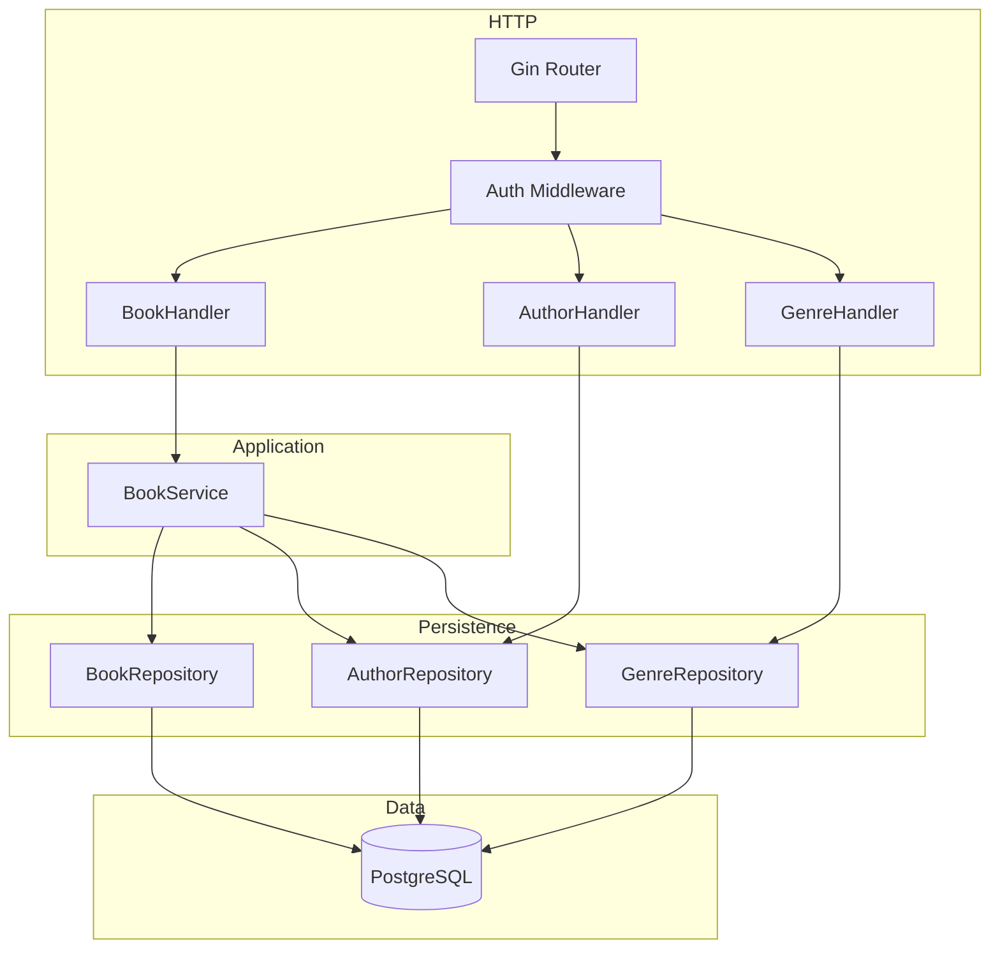
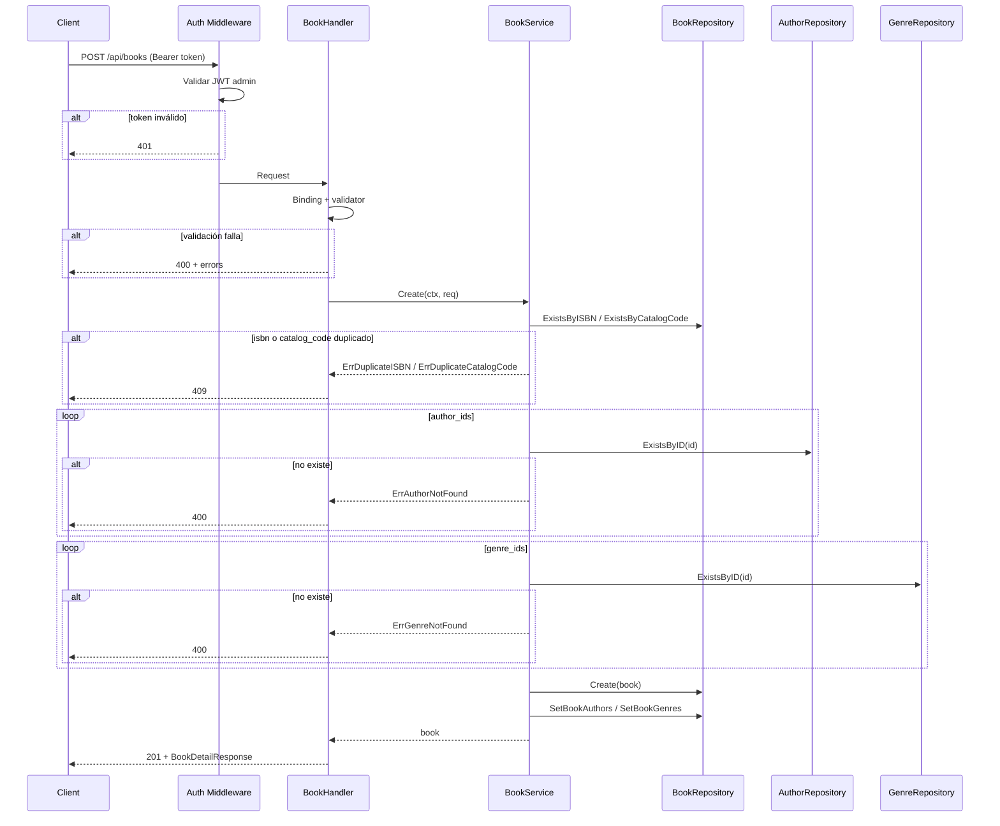
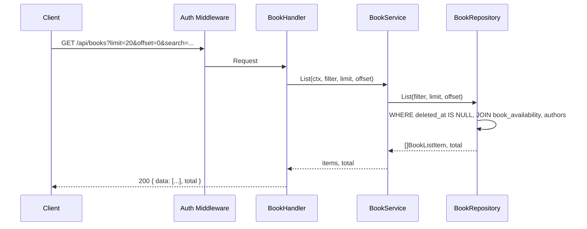

# Overview

Módulo de gestión del catálogo de libros en Go con Gin y PostgreSQL. Arquitectura en capas: **handlers** → **services** → **repositories**. Endpoints: crear libro, listar (vista resumida: cover_url, title, author(s), isbn, status), detalle completo (con autores, géneros, location, status), actualizar libro, eliminar (soft delete con `deleted_at`). Catálogos auxiliares GET para autores y géneros. La tabla `books` requiere la columna `deleted_at TIMESTAMPTZ NULL` para soft delete (migración adicional si no existe). Status se obtiene de la vista `book_availability` o calculando préstamos activos. Validación con go-playground/validator/v10. Todos los endpoints protegidos con JWT admin.

# Architecture

## Diagrama de componentes



## Diagrama de secuencia – Crear libro



## Diagrama de secuencia – Listar libros (resumido)



# Components and Interfaces

## Stack

Gin, go-playground/validator/v10, pgx o database/sql, middleware JWT admin. Misma arquitectura que el resto del proyecto.

## Contratos API

| Método | Ruta | Descripción | Body / Query | Respuestas |
|--------|------|-------------|--------------|------------|
| POST | `/api/books` | Crear libro | CreateBookRequest | 201, 400, 401, 409, 500 |
| GET | `/api/books` | Listar libros (resumido) | Query: limit, offset, search | 200, 401, 500 |
| GET | `/api/books/:id` | Detalle completo del libro | — | 200, 401, 404, 500 |
| PUT | `/api/books/:id` | Actualizar libro (completo) | UpdateBookRequest | 200, 400, 401, 404, 409, 500 |
| PATCH | `/api/books/:id` | Actualizar libro (parcial) | UpdateBookRequest | 200, 400, 401, 404, 409, 500 |
| DELETE | `/api/books/:id` | Soft delete libro | — | 204, 401, 404, 500 |
| GET | `/api/authors` | Listar autores (catálogo) | — | 200, 401, 500 |
| GET | `/api/genres` | Listar géneros (catálogo) | — | 200, 401, 500 |

Paginación listado: `limit` (default 20, max 100), `offset` (default 0). Respuesta listado: `{ "data": [...], "total": N }`.

## DTOs

```go
// CreateBookRequest
type CreateBookRequest struct {
    Title            string   `json:"title"             binding:"required,max=300"`
    ISBN             string   `json:"isbn"              binding:"required,max=20"`
    CatalogCode      string   `json:"catalog_code"      binding:"required,max=20"`
    Synopsis         *string  `json:"synopsis"          binding:"omitempty"`
    PublicationYear  *int     `json:"publication_year"  binding:"omitempty"`
    Pages            *int     `json:"pages"             binding:"omitempty,min=0"`
    CoverURL         *string  `json:"cover_url"         binding:"omitempty,url"`
    Location         *string  `json:"location"          binding:"omitempty,max=200"`
    TotalCopies      *int     `json:"total_copies"      binding:"omitempty,min=0"`
    AuthorIDs        []string `json:"author_ids"         binding:"omitempty,dive,uuid"`
    GenreIDs         []string `json:"genre_ids"          binding:"omitempty,dive,uuid"`
}

// UpdateBookRequest — todos opcionales para PATCH
type UpdateBookRequest struct {
    Title            *string  `json:"title"             binding:"omitempty,max=300"`
    ISBN             *string  `json:"isbn"              binding:"omitempty,max=20"`
    CatalogCode      *string  `json:"catalog_code"      binding:"omitempty,max=20"`
    Synopsis         *string  `json:"synopsis"           binding:"omitempty"`
    PublicationYear  *int     `json:"publication_year"   binding:"omitempty"`
    Pages            *int     `json:"pages"              binding:"omitempty,min=0"`
    CoverURL         *string  `json:"cover_url"          binding:"omitempty,url"`
    Location         *string  `json:"location"          binding:"omitempty,max=200"`
    TotalCopies      *int     `json:"total_copies"      binding:"omitempty,min=0"`
    AuthorIDs        []string `json:"author_ids"         binding:"omitempty,dive,uuid"`
    GenreIDs         []string `json:"genre_ids"          binding:"omitempty,dive,uuid"`
}

// BookListItem — respuesta del listado (solo imagen, título, autor, isbn, status)
type BookListItem struct {
    ID        string  `json:"id"`
    CoverURL  *string `json:"cover_url,omitempty"`
    Title     string  `json:"title"`
    Author    string  `json:"author"`   // nombres concatenados, ej. "Author A, Author B"
    ISBN     string  `json:"isbn"`
    Status   string  `json:"status"`   // "available" | "borrowed"
}

// BookDetailResponse — detalle completo con relaciones
type BookDetailResponse struct {
    ID               string           `json:"id"`
    Title            string           `json:"title"`
    ISBN             string           `json:"isbn"`
    CatalogCode      string           `json:"catalog_code"`
    Synopsis         *string          `json:"synopsis,omitempty"`
    PublicationYear  *int             `json:"publication_year,omitempty"`
    Pages            *int             `json:"pages,omitempty"`
    CoverURL         *string          `json:"cover_url,omitempty"`
    Location         *string          `json:"location,omitempty"`
    TotalCopies      int              `json:"total_copies"`
    Status           string           `json:"status"`
    Authors          []AuthorRef      `json:"authors"`
    Genres           []GenreRef       `json:"genres"`
    CreatedAt        string           `json:"created_at"`
    UpdatedAt        string           `json:"updated_at"`
}

type AuthorRef struct {
    ID   string `json:"id"`
    Name string `json:"name"`
}

type GenreRef struct {
    ID   string `json:"id"`
    Name string `json:"name"`
    Code string `json:"code"`
}

// AuthorResponse (catálogo)
type AuthorResponse struct {
    ID   string `json:"id"`
    Name string `json:"name"`
}

// GenreResponse (catálogo)
type GenreResponse struct {
    ID   string `json:"id"`
    Name string `json:"name"`
    Code string `json:"code"`
}

// ListBooksResponse
type ListBooksResponse struct {
    Data  []BookListItem `json:"data"`
    Total int64          `json:"total"`
}
```

## Interfaces de dominio

```go
// BookRepository
type BookRepository interface {
    Create(ctx context.Context, b *Book) error
    GetByID(ctx context.Context, id string) (*Book, error)  // excluye deleted_at != null
    List(ctx context.Context, filter BookFilter, limit, offset int) ([]BookListItem, int64, error)
    Update(ctx context.Context, b *Book) error
    SoftDelete(ctx context.Context, id string) error
    ExistsByISBN(ctx context.Context, isbn string, excludeID string) (bool, error)
    ExistsByCatalogCode(ctx context.Context, code string, excludeID string) (bool, error)
    SetBookAuthors(ctx context.Context, bookID string, authorIDs []string) error   // replace
    SetBookGenres(ctx context.Context, bookID string, genreIDs []string) error     // replace
    GetBookAuthors(ctx context.Context, bookID string) ([]AuthorRef, error)
    GetBookGenres(ctx context.Context, bookID string) ([]GenreRef, error)
    GetBookStatus(ctx context.Context, bookID string) (string, error)               // available | borrowed
}

type BookFilter struct {
    Search string // título, autor o ISBN (trigram/LIKE)
}

// AuthorRepository (solo lectura para catálogo y validación)
type AuthorRepository interface {
    List(ctx context.Context) ([]Author, error)
    ExistsByID(ctx context.Context, id string) (bool, error)
}

// GenreRepository
type GenreRepository interface {
    List(ctx context.Context) ([]Genre, error)
    ExistsByID(ctx context.Context, id string) (bool, error)
}

// BookService
type BookService interface {
    Create(ctx context.Context, req CreateBookRequest) (*BookDetailResponse, error)
    GetByID(ctx context.Context, id string) (*BookDetailResponse, error)
    List(ctx context.Context, filter BookFilter, limit, offset int) ([]BookListItem, int64, error)
    Update(ctx context.Context, id string, req UpdateBookRequest) (*BookDetailResponse, error)
    Delete(ctx context.Context, id string) error
}
```

Errores de dominio:

```go
var (
    ErrBookNotFound         = errors.New("book not found")
    ErrAuthorNotFound       = errors.New("author not found")
    ErrGenreNotFound        = errors.New("genre not found")
    ErrDuplicateISBN        = errors.New("isbn already exists")
    ErrDuplicateCatalogCode = errors.New("catalog_code already exists")
)
```

# Data Models

## PostgreSQL

**Tabla `books`** (existente en `001_initial_schema.sql`). Para soft delete se requiere **migración adicional** que agregue:

```sql
ALTER TABLE books ADD COLUMN deleted_at TIMESTAMPTZ NULL;
CREATE INDEX idx_books_deleted_at ON books (deleted_at) WHERE deleted_at IS NULL;
```

Las consultas de listado y detalle deben filtrar `WHERE deleted_at IS NULL`.

**Vista `book_availability`:** ya existe y devuelve `book_id`, `title`, `catalog_code`, `total_copies`, `checked_out`, `available_copies`, `status`. La subconsulta de préstamos debe contar filas con `status IN ('active','overdue')` para que las copias en mora sigan contando como prestadas (alineado con el job de préstamos en `functionalities/loan`). La vista no filtra por `deleted_at`; si se añade la columna a `books`, se puede crear una vista que excluya eliminados o filtrar en la consulta que use la vista.

**Listado (resumido):** consulta a `books` (WHERE deleted_at IS NULL) con JOIN a la lógica de status (vista o subconsulta de préstamos activos) y agregación de nombres de autores (book_authors + authors). Proyección: id, cover_url, title, author(s) concatenados, isbn, status.

**Detalle:** SELECT book por ID (deleted_at IS NULL), GetBookAuthors, GetBookGenres, GetBookStatus; armar BookDetailResponse.

**Autores:** tabla `authors` (id, name, bio, created_at).  
**Géneros:** tabla `genres` (id, name, code, created_at).  
**Relaciones:** `book_authors(book_id, author_id)`, `book_genres(book_id, genre_id)`.

## Entidades Go

```go
type Book struct {
    ID              string     `json:"id"`
    Title           string     `json:"title"`
    ISBN            string     `json:"isbn"`
    CatalogCode     string     `json:"catalog_code"`
    Synopsis        *string    `json:"synopsis,omitempty"`
    PublicationYear *int       `json:"publication_year,omitempty"`
    Pages           *int       `json:"pages,omitempty"`
    CoverURL        *string    `json:"cover_url,omitempty"`
    Location        *string    `json:"location,omitempty"`
    TotalCopies     int        `json:"total_copies"`
    DeletedAt       *time.Time `json:"-"`
    CreatedAt       time.Time  `json:"created_at"`
    UpdatedAt       time.Time  `json:"updated_at"`
}

type Author struct {
    ID   string `json:"id"`
    Name string `json:"name"`
}

type Genre struct {
    ID   string `json:"id"`
    Name string `json:"name"`
    Code string `json:"code"`
}
```

# Correctness Properties

### Property 1: Unicidad de ISBN

*For any* creación o actualización que deje un ISBN duplicado (excluyendo el propio ID), el sistema SHALL devolver 409.

**Validates:** Requirement 1.2, 4.3

### Property 2: Unicidad de catalog_code

*For any* creación o actualización que deje un catalog_code duplicado (excluyendo el propio ID), el sistema SHALL devolver 409.

**Validates:** Requirement 1.2, 4.3

### Property 3: Listado excluye eliminados

*For any* libro con `deleted_at` no nulo, SHALL no aparecer en el listado ni en GET por ID (404).

**Validates:** Requirements 2.1, 3.2, 5.1

### Property 4: Listado solo campos resumidos

*For any* elemento del listado de libros, la respuesta SHALL contener únicamente los campos definidos en BookListItem (cover_url, title, author, isbn, status; más id para referencia).

**Validates:** Requirement 2.1

### Property 5: Detalle incluye relaciones

*For any* GET por ID de un libro no eliminado, la respuesta SHALL incluir autores, géneros y location además de todos los campos del libro y status.

**Validates:** Requirement 3.1

### Property 6: author_ids y genre_ids existen

*For any* creación o actualización con author_ids o genre_ids, si algún ID no existe en su tabla, el sistema SHALL rechazar con 400.

**Validates:** Requirement 1.3, 4.4

# Error Handling

- **400:** Validación (validator + author_id/genre_id inexistentes). Payload: message + errors por campo.
- **401:** Sin token o token no admin en cualquier endpoint del catálogo.
- **404:** Libro no encontrado o eliminado en Get, Update, Delete.
- **409:** Conflicto por isbn o catalog_code duplicado en Create o Update.
- **500:** Error interno; mensaje genérico, log del error.

# Testing Strategy

- **BookRepository:** Create, GetByID (excluyendo deleted), List con filtro search y paginación, Update, SoftDelete, ExistsByISBN, ExistsByCatalogCode, SetBookAuthors, SetBookGenres, GetBookAuthors, GetBookGenres, GetBookStatus.
- **BookService:** Create (éxito, isbn/catalog_code duplicado, author/genre no existe), GetByID (ok, not found), List (paginación, filtro), Update (ok, not found, duplicado, author/genre no existe), Delete (ok, not found). Mocks de repositorios.
- **Handlers:** Cada endpoint con casos 200/201/204, 400, 401, 404, 409. Verificar estructura JSON del listado (solo campos resumidos) y del detalle (con autores, géneros, location).
- **AuthorRepository / GenreRepository:** List, ExistsByID.
- **Properties:** Unicidad ISBN/catalog_code, listado sin eliminados, listado solo campos resumidos, detalle con relaciones.
