# Diagramas UML — Lumina Library

---

## 1. Diagrama de Casos de Uso

```mermaid
flowchart LR
    %% ──────────── ACTORES ────────────
    Admin(("👤 Administrador\n/ Bibliotecario"))
    Cron(("⏱️ Sistema\n(Cron)"))

    %% ──────────── AUTENTICACIÓN ────────────
    subgraph AUTH ["🔐 Autenticación"]
        direction TB
        UC_REG["Registrar usuario"]
        UC_LOGIN["Iniciar sesión"]
        UC_REFRESH["Renovar tokens"]
        UC_LOGOUT["Cerrar sesión"]
    end

    Admin --- UC_REG
    Admin --- UC_LOGIN
    Admin --- UC_REFRESH
    Admin --- UC_LOGOUT
    Cron --- UC_CRON_BL

    subgraph AUTH_SYS ["🔐 Autenticación — Sistema"]
        UC_CRON_BL["Limpiar blacklist\n(cron cada 2 días)"]
    end

    %% ──────────── ESTUDIANTES ────────────
    subgraph STU ["🎓 Gestión de Estudiantes"]
        direction TB
        UC_CREATE_STU["Crear estudiante"]
        UC_LIST_STU["Listar estudiantes"]
        UC_SEARCH_STU["Buscar estudiante\n(email, matrícula, nombre)"]
        UC_GET_STU["Obtener estudiante por ID"]
        UC_UPD_STU["Actualizar estudiante"]
        UC_DEL_STU["Desactivar estudiante\n(soft delete)"]
        UC_PROFILE["Ver perfil del estudiante\n(stats, historial, badges)"]
        UC_BADGE["Otorgar insignia\na estudiante"]
        UC_LIST_DEPT["Listar departamentos"]
    end

    Admin --- UC_CREATE_STU
    Admin --- UC_LIST_STU
    Admin --- UC_SEARCH_STU
    Admin --- UC_GET_STU
    Admin --- UC_UPD_STU
    Admin --- UC_DEL_STU
    Admin --- UC_PROFILE
    Admin --- UC_BADGE
    Admin --- UC_LIST_DEPT

    %% ──────────── CATÁLOGO ────────────
    subgraph CAT ["📚 Catálogo de Libros"]
        direction TB
        UC_CREATE_BOOK["Crear libro"]
        UC_LIST_BOOK["Listar libros\n(vista resumida)"]
        UC_DET_BOOK["Ver detalle del libro"]
        UC_UPD_BOOK["Actualizar libro"]
        UC_DEL_BOOK["Eliminar libro\n(soft delete)"]
        UC_LIST_AUTHORS["Listar autores"]
        UC_LIST_GENRES["Listar géneros"]
    end

    Admin --- UC_CREATE_BOOK
    Admin --- UC_LIST_BOOK
    Admin --- UC_DET_BOOK
    Admin --- UC_UPD_BOOK
    Admin --- UC_DEL_BOOK
    Admin --- UC_LIST_AUTHORS
    Admin --- UC_LIST_GENRES

    %% ──────────── PRÉSTAMOS ────────────
    subgraph LOAN ["📖 Préstamos"]
        direction TB
        UC_LIST_LOAN["Listar préstamos\n(filtro status, student_id)"]
        UC_CREATE_LOAN["Crear préstamo"]
        UC_RETURN["Devolver libro"]
    end

    Admin --- UC_LIST_LOAN
    Admin --- UC_CREATE_LOAN
    Admin --- UC_RETURN

    %% ──────────── MULTAS ────────────
    subgraph FINE ["💰 Multas"]
        direction TB
        UC_LIST_FINE["Listar multas\n(filtro student, status)"]
        UC_CREATE_FINE["Crear multa"]
        UC_GET_FINE["Ver multa por ID"]
        UC_PAY_FINE["Marcar multa\ncomo pagada"]
        UC_WAIVE_FINE["Condonar multa"]
    end

    Admin --- UC_LIST_FINE
    Admin --- UC_CREATE_FINE
    Admin --- UC_GET_FINE
    Admin --- UC_PAY_FINE
    Admin --- UC_WAIVE_FINE

    %% ──────────── SANCIONES ────────────
    subgraph SANC ["⚠️ Sanciones"]
        direction TB
        UC_LIST_SANC["Listar estudiantes\nsancionados"]
        UC_CREATE_SANC["Crear sanción"]
        UC_LIFT_SANC["Levantar sanción"]
    end

    Admin --- UC_LIST_SANC
    Admin --- UC_CREATE_SANC
    Admin --- UC_LIFT_SANC

    %% ──────────── RANKING ────────────
    subgraph RANK ["🏆 Ranking"]
        direction TB
        UC_TOP3["Ver Top 3\n(Top Readers)"]
        UC_LEADER["Ver leaderboard\n(global + tu puesto)"]
    end

    Admin --- UC_TOP3
    Admin --- UC_LEADER

    %% ──────────── ANALYTICS ────────────
    subgraph ANALYTICS ["📊 Analytics / Dashboard"]
        direction TB
        UC_DASH["Ver dashboard\n(total books, active students,\noverdue fines, most borrowed,\nrecent activity)"]
    end

    Admin --- UC_DASH

    %% ──────────── REPUTACIÓN (interno) ────────────
    subgraph REP ["🎯 Reputación (servicio interno)"]
        direction TB
        UC_RECORD_RET["RecordReturn\n(evento + stats)"]
        UC_RECORD_LOAN["RecordLoanCreated\n(active_loans++)"]
    end

    UC_RETURN -.->|"<<include>>"| UC_RECORD_RET
    UC_CREATE_LOAN -.->|"<<include>>"| UC_RECORD_LOAN
    UC_RETURN -.->|"<<extend>>\nsi devolución tardía"| UC_CREATE_FINE
```

---

## 2. Diagrama de Clases UML (Modelo de Datos)

```mermaid
classDiagram
    direction TB

    %% ══════════════ AUTENTICACIÓN ══════════════
    class users {
        +UUID id PK
        +VARCHAR(100) first_name
        +VARCHAR(100) last_name
        +VARCHAR(255) email UK
        +VARCHAR(255) password_hash
        +user_role role ~admin | librarian~
        +TEXT avatar_url
        +BOOLEAN is_active
        +TIMESTAMPTZ created_at
        +TIMESTAMPTZ updated_at
    }

    class revoked_tokens {
        +VARCHAR(36) jti PK
        +UUID user_id FK
        +TIMESTAMPTZ expires_at
        +TIMESTAMPTZ revoked_at
    }

    users "1" --> "*" revoked_tokens : user_id

    %% ══════════════ DEPARTAMENTOS ══════════════
    class departments {
        +UUID id PK
        +VARCHAR(200) name UK
        +VARCHAR(20) code UK
        +TIMESTAMPTZ created_at
    }

    %% ══════════════ ESTUDIANTES ══════════════
    class students {
        +UUID id PK
        +VARCHAR(50) student_id_code UK
        +VARCHAR(200) first_name
        +VARCHAR(200) last_name
        +VARCHAR(255) email UK
        +TEXT avatar_url
        +UUID department_id FK
        +VARCHAR(100) degree_level
        +VARCHAR(200) major
        +SMALLINT expected_graduation_year
        +BOOLEAN is_active
        +TIMESTAMPTZ member_since
        +UUID registered_by FK
        +TIMESTAMPTZ created_at
        +TIMESTAMPTZ updated_at
    }

    departments "1" --> "*" students : department_id
    users "1" --> "*" students : registered_by

    %% ══════════════ CATÁLOGO DE LIBROS ══════════════
    class books {
        +UUID id PK
        +VARCHAR(255) title
        +VARCHAR(20) isbn UK
        +VARCHAR(50) catalog_code UK
        +TEXT synopsis
        +SMALLINT publication_year
        +INT pages
        +TEXT cover_url
        +VARCHAR(200) location
        +INT total_copies
        +TIMESTAMPTZ deleted_at
        +TIMESTAMPTZ created_at
        +TIMESTAMPTZ updated_at
    }

    class authors {
        +UUID id PK
        +VARCHAR(200) name
        +TEXT bio
    }

    class genres {
        +UUID id PK
        +VARCHAR(100) name UK
        +VARCHAR(20) code UK
    }

    class book_authors {
        +UUID book_id FK
        +UUID author_id FK
    }

    class book_genres {
        +UUID book_id FK
        +UUID genre_id FK
    }

    books "1" --> "*" book_authors : book_id
    authors "1" --> "*" book_authors : author_id
    books "1" --> "*" book_genres : book_id
    genres "1" --> "*" book_genres : genre_id

    %% ══════════════ PRÉSTAMOS ══════════════
    class loans {
        +UUID id PK
        +UUID book_id FK
        +UUID student_id FK
        +UUID issued_by FK
        +TIMESTAMPTZ borrowed_at
        +DATE due_date
        +TIMESTAMPTZ returned_at
        +loan_status status ~active | returned | overdue~
        +TIMESTAMPTZ created_at
        +TIMESTAMPTZ updated_at
    }

    books "1" --> "*" loans : book_id
    students "1" --> "*" loans : student_id
    users "1" --> "*" loans : issued_by

    %% ══════════════ MULTAS ══════════════
    class fines {
        +UUID id PK
        +UUID loan_id FK
        +UUID student_id FK
        +DECIMAL amount
        +fine_status status ~pending | paid | waived~
        +TEXT reason
        +TIMESTAMPTZ paid_at
        +TIMESTAMPTZ created_at
        +TIMESTAMPTZ updated_at
    }

    loans "1" --> "*" fines : loan_id
    students "1" --> "*" fines : student_id

    %% ══════════════ SANCIONES ══════════════
    class sanctions {
        +UUID id PK
        +UUID student_id FK
        +TEXT reason
        +sanction_status status ~active | lifted~
        +TIMESTAMPTZ applied_at
        +UUID applied_by FK
        +TIMESTAMPTZ lifted_at
        +UUID lifted_by FK
        +TIMESTAMPTZ created_at
        +TIMESTAMPTZ updated_at
    }

    students "1" --> "*" sanctions : student_id
    users "1" --> "*" sanctions : applied_by
    users "1" --> "*" sanctions : lifted_by

    %% ══════════════ REPUTACIÓN ══════════════
    class reputation_events {
        +UUID id PK
        +UUID student_id FK
        +event_type event_type
        +INT points
        +TEXT description
        +UUID reference_id
        +TIMESTAMPTZ created_at
    }

    class student_stats {
        +UUID id PK
        +UUID student_id FK UK
        +INT total_read
        +INT active_loans
        +INT overdue_count
        +INT current_streak_days
        +INT longest_streak_days
        +INT total_points
        +INT global_rank
        +TIMESTAMPTZ created_at
        +TIMESTAMPTZ updated_at
    }

    students "1" --> "*" reputation_events : student_id
    students "1" --> "0..1" student_stats : student_id

    %% ══════════════ INSIGNIAS ══════════════
    class badges {
        +UUID id PK
        +VARCHAR(50) slug UK
        +VARCHAR(100) name
        +TEXT icon_url
        +TEXT description
        +TEXT criteria
        +TIMESTAMPTZ created_at
    }

    class student_badges {
        +UUID id PK
        +UUID student_id FK
        +UUID badge_id FK
        +TIMESTAMPTZ earned_at
    }

    students "1" --> "*" student_badges : student_id
    badges "1" --> "*" student_badges : badge_id

    %% ══════════════ ACTIVITY LOG ══════════════
    class activity_log {
        +UUID id PK
        +VARCHAR(50) event_type
        +VARCHAR(255) title
        +TEXT description
        +UUID student_id FK
        +UUID actor_id FK
        +JSONB metadata
        +TIMESTAMPTZ created_at
    }

    students "1" --> "*" activity_log : student_id
    users "1" --> "*" activity_log : actor_id

    %% ══════════════ VISTA LEADERBOARD ══════════════
    class leaderboard {
        <<view>>
        +UUID student_id
        +VARCHAR first_name
        +VARCHAR last_name
        +TEXT avatar_url
        +INT total_points
        +INT total_read
        +INT current_streak_days
        +BIGINT rank_position
    }

    student_stats ..> leaderboard : "RANK() OVER\n(ORDER BY total_points DESC)"
    students ..> leaderboard : "JOIN"

    %% ══════════════ VISTA BOOK_AVAILABILITY ══════════════
    class book_availability {
        <<view>>
        +UUID book_id
        +INT total_copies
        +INT active_loans
        +INT available_copies
        +VARCHAR status ~available | borrowed~
    }

    books ..> book_availability : "LEFT JOIN loans\n(status=active)"
```

---

## Leyenda de relaciones

| Símbolo | Significado |
|---------|-------------|
| `1 --> *` | Uno a muchos (FK) |
| `1 --> 0..1` | Uno a cero o uno |
| `..>` | Derivación (vista SQL) |
| `-.-> <<include>>` | Caso de uso incluido (se ejecuta siempre) |
| `-.-> <<extend>>` | Caso de uso extendido (condicional) |

## Resumen de entidades

| # | Entidad/Tabla | Módulo |
|---|--------------|--------|
| 1 | `users` | Autenticación |
| 2 | `revoked_tokens` | Autenticación |
| 3 | `departments` | Estudiantes |
| 4 | `students` | Estudiantes |
| 5 | `books` | Catálogo |
| 6 | `authors` | Catálogo |
| 7 | `genres` | Catálogo |
| 8 | `book_authors` | Catálogo (M:N) |
| 9 | `book_genres` | Catálogo (M:N) |
| 10 | `loans` | Préstamos |
| 11 | `fines` | Multas |
| 12 | `sanctions` | Sanciones |
| 13 | `reputation_events` | Reputación |
| 14 | `student_stats` | Reputación |
| 15 | `badges` | Estudiantes (insignias) |
| 16 | `student_badges` | Estudiantes (M:N) |
| 17 | `activity_log` | Analytics / Reputación |
| 18 | `leaderboard` *(vista)* | Ranking |
| 19 | `book_availability` *(vista)* | Catálogo |
