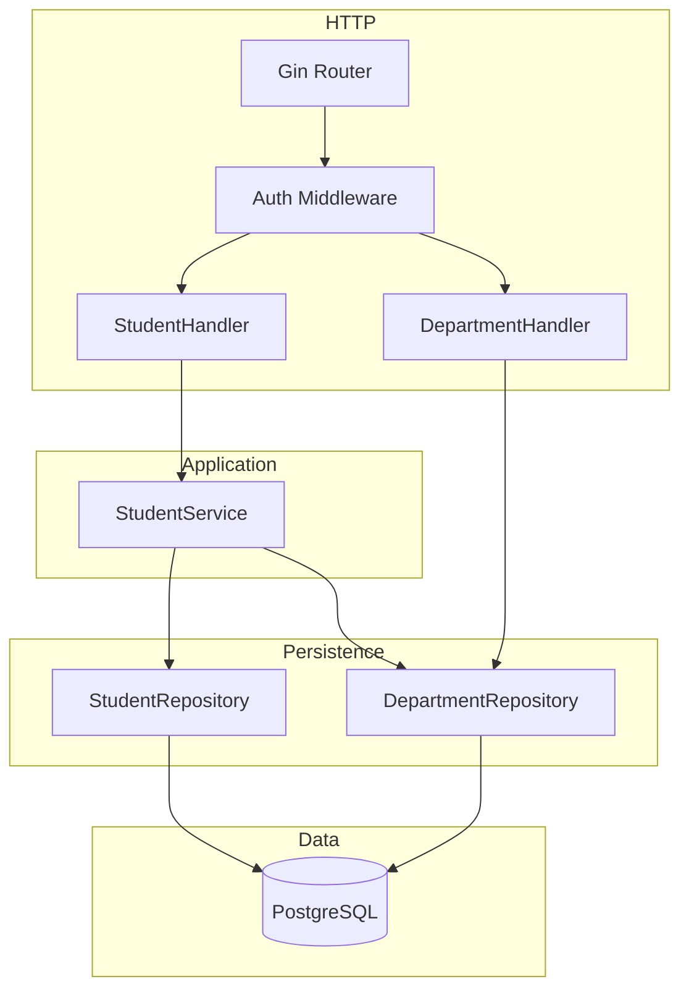
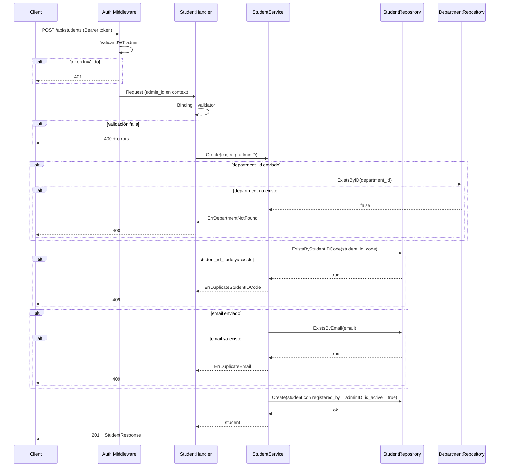
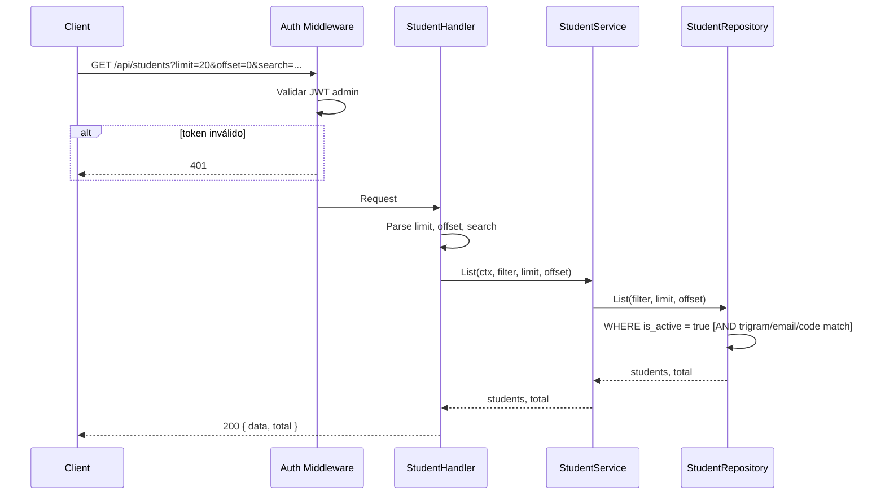
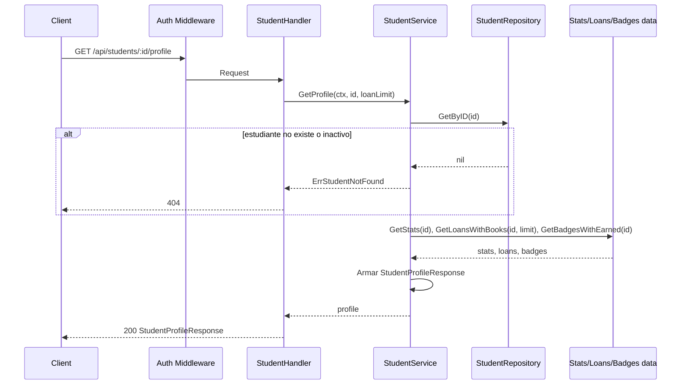

# Overview

Módulo de estudiantes (patrons) en Go con Gin y PostgreSQL. Arquitectura en capas (handlers → services → repositories). Los estudiantes NO tienen credenciales; son gestionados por admins/bibliotecarios (tabla `users`). Tabla `students` con soft delete via `is_active` (booleano), campo `registered_by` (FK a `users`), y campos académicos opcionales (`degree_level`, `major`, `expected_graduation_year`). Catálogo de departamentos en tabla `departments` (con `name` y `code`). Todos los endpoints protegidos con middleware JWT (rol admin). Validación con `go-playground/validator/v10`. Paginación en listado (limit/offset, default 20, max 100). Búsqueda por nombre usando índice trigram (`pg_trgm`).

# Architecture

## Diagrama de componentes



## Diagrama de secuencia – Crear estudiante



## Diagrama de secuencia – Listar estudiantes



## Diagrama de secuencia – Obtener perfil del estudiante



# Components and Interfaces

## Stack

Mismo stack del proyecto: Gin, `go-playground/validator/v10`, pgx (o `database/sql`), middleware JWT para proteger rutas.

## Contratos API

Todas las rutas bajo `/api` protegidas con middleware JWT que valida rol admin.

| Método | Ruta | Descripción | Body / Query | Respuestas |
|--------|------|-------------|-------------|------------|
| POST | `/api/students` | Crear estudiante | `CreateStudentRequest` | 201, 400, 401, 409, 500 |
| GET | `/api/students` | Listar estudiantes (paginado) y **búsqueda** por email, student_id_code o nombre | Query: `limit`, `offset`, `search` | 200, 400, 401, 500 |
| GET | `/api/students/:id` | Obtener estudiante por ID | — | 200, 401, 404, 500 |
| GET | `/api/students/:id/profile` | **Perfil completo:** datos del estudiante + Personal Stats + Loan History + Badge Gallery | Query opcional: `loan_limit` (ej. 10) | 200, 401, 404, 500 |
| PATCH | `/api/students/:id` | Actualizar estudiante (parcial) | `UpdateStudentRequest` | 200, 400, 401, 404, 409, 500 |
| DELETE | `/api/students/:id` | Desactivar estudiante (soft delete) | — | 204, 401, 404, 500 |
| POST | `/api/students/:id/badges` | **Otorgar insignia** al estudiante | `AwardBadgeRequest` | 200/201, 400, 401, 404, 409, 500 |
| GET | `/api/departments` | Listar departamentos (catálogo) | — | 200, 401, 500 |

Paginación: `limit` (default 20, max 100), `offset` (default 0). Respuesta de listado: `{ "data": [...], "total": N }`.

## DTOs

```go
// CreateStudentRequest — campos obligatorios: first_name, last_name, student_id_code
type CreateStudentRequest struct {
    FirstName              string  `json:"first_name"               binding:"required,max=100"`
    LastName               string  `json:"last_name"                binding:"required,max=100"`
    StudentIDCode          string  `json:"student_id_code"          binding:"required,max=50"`
    Email                  *string `json:"email"                    binding:"omitempty,email,max=255"`
    AvatarURL              *string `json:"avatar_url"               binding:"omitempty,url"`
    DepartmentID           *string `json:"department_id"            binding:"omitempty,uuid"`
    DegreeLevel            *string `json:"degree_level"             binding:"omitempty,max=100"`
    Major                  *string `json:"major"                    binding:"omitempty,max=150"`
    ExpectedGraduationYear *int    `json:"expected_graduation_year" binding:"omitempty"`
}

// UpdateStudentRequest — todos opcionales (PATCH)
type UpdateStudentRequest struct {
    FirstName              *string `json:"first_name"               binding:"omitempty,max=100"`
    LastName               *string `json:"last_name"                binding:"omitempty,max=100"`
    StudentIDCode          *string `json:"student_id_code"          binding:"omitempty,max=50"`
    Email                  *string `json:"email"                    binding:"omitempty,email,max=255"`
    AvatarURL              *string `json:"avatar_url"               binding:"omitempty,url"`
    DepartmentID           *string `json:"department_id"            binding:"omitempty,uuid"`
    DegreeLevel            *string `json:"degree_level"             binding:"omitempty,max=100"`
    Major                  *string `json:"major"                    binding:"omitempty,max=150"`
    ExpectedGraduationYear *int    `json:"expected_graduation_year" binding:"omitempty"`
}

// StudentResponse — respuesta pública del estudiante
type StudentResponse struct {
    ID                     string  `json:"id"`
    StudentIDCode          string  `json:"student_id_code"`
    FirstName              string  `json:"first_name"`
    LastName               string  `json:"last_name"`
    Email                  *string `json:"email,omitempty"`
    AvatarURL              *string `json:"avatar_url,omitempty"`
    DepartmentID           *string `json:"department_id,omitempty"`
    DepartmentName         *string `json:"department_name,omitempty"`
    DepartmentCode         *string `json:"department_code,omitempty"`
    DegreeLevel            *string `json:"degree_level,omitempty"`
    Major                  *string `json:"major,omitempty"`
    ExpectedGraduationYear *int    `json:"expected_graduation_year,omitempty"`
    IsActive               bool    `json:"is_active"`
    MemberSince            string  `json:"member_since"`
    CreatedAt              string  `json:"created_at"`
    UpdatedAt              string  `json:"updated_at"`
}

// DepartmentResponse
type DepartmentResponse struct {
    ID   string `json:"id"`
    Name string `json:"name"`
    Code string `json:"code"`
}

// ListStudentsResponse
type ListStudentsResponse struct {
    Data  []StudentResponse `json:"data"`
    Total int64             `json:"total"`
}

// --- Perfil del estudiante (Requirement 9) ---

// PersonalStats — estadísticas personales (student_stats)
type PersonalStats struct {
    TotalRead          int  `json:"total_read"`
    ActiveLoans        int  `json:"active_loans"`
    OverdueCount       int  `json:"overdue_count"`
    CurrentStreakDays  int  `json:"current_streak_days"`
    LongestStreakDays  int  `json:"longest_streak_days,omitempty"`
    TotalPoints        int  `json:"total_points,omitempty"`
    GlobalRank         *int `json:"global_rank,omitempty"`
}

// LoanHistoryItem — un ítem del historial de préstamos (para perfil)
type LoanHistoryItem struct {
    LoanID     string   `json:"loan_id"`
    BookID     string   `json:"book_id"`
    Title      string   `json:"title"`
    CoverURL   *string  `json:"cover_url,omitempty"`
    Authors    []string `json:"authors"`           // nombres de autores
    BorrowedAt string   `json:"borrowed_at"`      // ISO timestamp
    DueDate    string   `json:"due_date"`         // ISO date
    ReturnedAt *string  `json:"returned_at,omitempty"`
    Status     string   `json:"status"`           // active | returned | overdue
}

// BadgeGalleryItem — una insignia en la galería (ganada o bloqueada)
type BadgeGalleryItem struct {
    ID          string  `json:"id"`
    Slug        string  `json:"slug"`
    Name        string  `json:"name"`
    Description *string `json:"description,omitempty"`
    IconURL     *string `json:"icon_url,omitempty"`
    Criteria    *string `json:"criteria,omitempty"`
    Earned      bool    `json:"earned"`
    EarnedAt    *string `json:"earned_at,omitempty"` // ISO timestamp si earned
}

// BadgeGallery — galería de insignias del perfil
type BadgeGallery struct {
    TotalBadges  int               `json:"total_badges"`
    EarnedCount  int               `json:"earned_count"`
    Badges       []BadgeGalleryItem `json:"badges"`
}

// AwardBadgeRequest — otorgar insignia (Requirement 10)
type AwardBadgeRequest struct {
    BadgeID string `json:"badge_id" binding:"required,uuid"`
}

// AwardBadgeResponse — respuesta al otorgar insignia
type AwardBadgeResponse struct {
    ID       string  `json:"id"`
    Slug     string  `json:"slug"`
    Name     string  `json:"name"`
    EarnedAt string  `json:"earned_at"` // ISO timestamp
}

// StudentProfileResponse — respuesta del perfil completo
type StudentProfileResponse struct {
    // Encabezado del perfil (datos del estudiante)
    ID                     string  `json:"id"`
    StudentIDCode          string  `json:"student_id_code"`
    FirstName              string  `json:"first_name"`
    LastName               string  `json:"last_name"`
    AvatarURL              *string `json:"avatar_url,omitempty"`
    DegreeLevel            *string `json:"degree_level,omitempty"`
    Major                  *string `json:"major,omitempty"`
    MemberSince            string  `json:"member_since"`
    DepartmentName         *string `json:"department_name,omitempty"`
    DepartmentCode         *string `json:"department_code,omitempty"`
    Email                  *string `json:"email,omitempty"`
    ExpectedGraduationYear *int    `json:"expected_graduation_year,omitempty"`
    // Secciones del dashboard
    PersonalStats PersonalStats   `json:"personal_stats"`
    LoanHistory   []LoanHistoryItem `json:"loan_history"`
    BadgeGallery  BadgeGallery   `json:"badge_gallery"`
}
```

## Interfaces de dominio

```go
// DepartmentRepository
type DepartmentRepository interface {
    List(ctx context.Context) ([]Department, error)
    ExistsByID(ctx context.Context, id string) (bool, error)
}

// StudentRepository
type StudentRepository interface {
    Create(ctx context.Context, s *Student) error
    GetByID(ctx context.Context, id string) (*Student, error)                       // WHERE is_active = true
    List(ctx context.Context, filter StudentFilter, limit, offset int) ([]Student, int64, error) // WHERE is_active = true
    Update(ctx context.Context, s *Student) error
    Deactivate(ctx context.Context, id string) error                                // SET is_active = false
    ExistsByStudentIDCode(ctx context.Context, code string, excludeID string) (bool, error)
    ExistsByEmail(ctx context.Context, email string, excludeID string) (bool, error)
}

type StudentFilter struct {
    // Search: término único que busca en email (ILIKE), student_id_code (ILIKE) y nombre completo (trigram o ILIKE first_name || ' ' || last_name)
    Search string
}
```

Errores de dominio:

```go
var (
    ErrStudentNotFound        = errors.New("student not found")
    ErrDepartmentNotFound     = errors.New("department not found")
    ErrDuplicateStudentIDCode = errors.New("student_id_code already exists")
    ErrDuplicateEmail         = errors.New("email already exists")
    ErrBadgeNotFound          = errors.New("badge not found")
    ErrBadgeAlreadyEarned     = errors.New("student already has this badge")
)
```

```go
// StudentService
type StudentService interface {
    Create(ctx context.Context, req CreateStudentRequest, adminID string) (*Student, error)
    GetByID(ctx context.Context, id string) (*Student, error)
    GetProfile(ctx context.Context, id string, loanLimit int) (*StudentProfileResponse, error) // Requirement 9
    List(ctx context.Context, filter StudentFilter, limit, offset int) ([]Student, int64, error)
    Update(ctx context.Context, id string, req UpdateStudentRequest) (*Student, error)
    Deactivate(ctx context.Context, id string) error
    AwardBadge(ctx context.Context, studentID, badgeID string) (*AwardBadgeResponse, error) // Requirement 10
}
```

El servicio `GetProfile` dependerá de: StudentRepository (GetByID), acceso a estadísticas del estudiante (student_stats: por ID, valores por defecto si no existe), préstamos del estudiante con datos de libro y autores (LoansByStudentID con JOIN books y book_authors/authors), y lista de insignias con las ganadas por el estudiante (AllBadges + StudentBadgesByStudentID, o un repo que devuelva badges con earned/earned_at por estudiante). Se puede implementar con un StudentProfileRepository que agregue estas consultas o reutilizando repos existentes (LoanRepository, BadgeRepository si existen) o queries ad hoc en un mismo módulo.

**Create estudiante (opcional):** Tras crear el estudiante, el servicio MAY invocar a un StudentStatsRepository.Upsert o Insert con valores en 0 para ese student_id, de modo que reputation/loan puedan actualizar stats sin crear la fila; si no se implementa, el módulo reputation hace upsert en RecordLoanCreated/RecordReturn.

**AwardBadge (Requirement 10):** StudentService.AwardBadge(ctx, studentID, badgeID): (1) GetByID(studentID) → si no existe o !is_active → ErrStudentNotFound. (2) BadgeRepository.ExistsByID(badgeID) o GetByID → si no existe → ErrBadgeNotFound. (3) StudentBadgeRepository.Exists(studentID, badgeID) → si ya existe → ErrBadgeAlreadyEarned (409). (4) StudentBadgeRepository.Create(studentID, badgeID, earnedAt = now). (5) Devolver AwardBadgeResponse con datos del badge y earned_at. Interfaces necesarias: BadgeRepository (ExistsByID o GetByID), StudentBadgeRepository (Exists, Create).

# Data Models

## PostgreSQL

**Tabla `departments`** (ya definida en `migrations/001_initial_schema.sql`)

| Columna    | Tipo         | Restricciones        | Descripción                |
|------------|--------------|----------------------|----------------------------|
| id         | UUID         | PK, DEFAULT uuid_generate_v4() | |
| name       | VARCHAR(150) | NOT NULL, UNIQUE     | Nombre del departamento    |
| code       | VARCHAR(20)  | NOT NULL, UNIQUE     | Código corto (ej. "CS")    |
| created_at | TIMESTAMPTZ  | NOT NULL, DEFAULT NOW() | |

**Tabla `students`** (ya definida en `migrations/001_initial_schema.sql`)

| Columna                  | Tipo         | Restricciones        | Descripción                          |
|--------------------------|--------------|----------------------|--------------------------------------|
| id                       | UUID         | PK, DEFAULT uuid_generate_v4() | |
| student_id_code          | VARCHAR(50)  | NOT NULL, UNIQUE     | Matrícula (ej. LUM-2024-001)         |
| first_name               | VARCHAR(100) | NOT NULL             | |
| last_name                | VARCHAR(100) | NOT NULL             | |
| email                    | VARCHAR(255) | UNIQUE (nullable)    | Email de contacto, no para login     |
| avatar_url               | TEXT         | nullable             | URL foto de perfil                   |
| department_id            | UUID         | FK departments(id) ON DELETE SET NULL | Departamento, opcional |
| degree_level             | VARCHAR(100) | nullable             | Ej. "Undergraduate Student"          |
| major                    | VARCHAR(150) | nullable             | Especialidad                         |
| expected_graduation_year | INT          | nullable             | Año previsto de graduación            |
| is_active                | BOOLEAN      | NOT NULL, DEFAULT TRUE | Soft delete: false = desactivado    |
| member_since             | TIMESTAMPTZ  | NOT NULL, DEFAULT NOW() | Fecha de membresía                |
| registered_by            | UUID         | FK users(id) ON DELETE SET NULL | Admin que registró        |
| created_at               | TIMESTAMPTZ  | NOT NULL, DEFAULT NOW() | |
| updated_at               | TIMESTAMPTZ  | NOT NULL, DEFAULT NOW() | Auto-update via trigger           |

**Índices existentes** (en `migrations/001_initial_schema.sql`)

| Índice                | Tipo                  | Columna(s)                          | Motivo                   |
|-----------------------|-----------------------|-------------------------------------|--------------------------|
| `students_pkey`       | PK                    | id                                  | Primary key              |
| `students_student_id_code_key` | UNIQUE         | student_id_code                     | Unicidad matrícula       |
| `students_email_key`  | UNIQUE                | email                               | Unicidad email           |
| `idx_students_code`   | INDEX                 | student_id_code                     | Búsqueda por código      |
| `idx_students_email`  | INDEX                 | email                               | Búsqueda por email       |
| `idx_students_name`   | GIN (pg_trgm)         | first_name \|\| ' ' \|\| last_name  | Búsqueda fuzzy por nombre|

**Trigger:** `trg_students_updated_at` — actualiza `updated_at` automáticamente en cada UPDATE.

**Tabla `student_stats`** (para Personal Stats del perfil): `student_id` (UNIQUE), `total_read`, `active_loans`, `overdue_count`, `current_streak_days`, `longest_streak_days`, `total_points`, `global_rank`. Si el estudiante no tiene fila (ej. recién creado), el perfil devuelve ceros o nulls.

**Préstamos para Loan History:** Tabla `loans` con JOIN a `books` (title, cover_url), y a autores vía `book_authors` + `authors` (nombres). Ordenar por borrowed_at DESC; limitar cantidad con `loan_limit` (ej. 10).

**Insignias para Badge Gallery:** Tabla `badges` (id, slug, name, description, icon_url, criteria) y `student_badges` (student_id, badge_id, earned_at). Consulta: todas las badges; para cada una, si existe fila en student_badges para el student_id entonces earned = true y earned_at; si no, earned = false. total_badges = COUNT(badges), earned_count = COUNT(student_badges WHERE student_id = :id).

**Comportamiento de búsqueda (endpoint de búsqueda):** El mismo GET `/api/students` actúa como listado y como endpoint de búsqueda. Cuando se envía el query param `search`:

- **Por email:** coincidencia parcial case-insensitive sobre `students.email` (ej. `search=john@` encuentra `john@mail.com`). Excluir filas con email NULL si el término no aplica.
- **Por student_id_code:** coincidencia parcial o exacta case-insensitive sobre `students.student_id_code` (ej. `search=LUM-2024` encuentra `LUM-2024-001`).
- **Por nombre:** coincidencia parcial sobre nombre completo (`first_name || ' ' || last_name`) usando índice GIN pg_trgm o ILIKE.

Un mismo término puede coincidir en cualquiera de los tres; la condición en el repositorio es OR (email LIKE ... OR student_id_code LIKE ... OR similarity(nombre_completo, search) > umbral).

## Entidades Go

```go
type Department struct {
    ID        string    `json:"id"`
    Name      string    `json:"name"`
    Code      string    `json:"code"`
    CreatedAt time.Time `json:"created_at"`
}

type Student struct {
    ID                     string     `json:"id"`
    StudentIDCode          string     `json:"student_id_code"`
    FirstName              string     `json:"first_name"`
    LastName               string     `json:"last_name"`
    Email                  *string    `json:"email,omitempty"`
    AvatarURL              *string    `json:"avatar_url,omitempty"`
    DepartmentID           *string    `json:"department_id,omitempty"`
    DegreeLevel            *string    `json:"degree_level,omitempty"`
    Major                  *string    `json:"major,omitempty"`
    ExpectedGraduationYear *int       `json:"expected_graduation_year,omitempty"`
    IsActive               bool       `json:"is_active"`
    MemberSince            time.Time  `json:"member_since"`
    RegisteredBy           *string    `json:"registered_by,omitempty"`
    CreatedAt              time.Time  `json:"created_at"`
    UpdatedAt              time.Time  `json:"updated_at"`

    // Populated via JOIN (not stored in students table)
    DepartmentName *string `json:"department_name,omitempty"`
    DepartmentCode *string `json:"department_code,omitempty"`
}
```

# Correctness Properties

### Property 1: Unicidad de student_id_code

*For any* dos estudiantes creados o actualizados con el mismo `student_id_code` (excluyendo el propio ID en update), solo uno puede persistir; el segundo intento SHALL devolver 409.

**Validates:** Requirement 1.2, 4.3

### Property 2: Unicidad de email

*For any* dos estudiantes creados o actualizados con el mismo `email` no nulo (excluyendo el propio ID en update), solo uno puede persistir; el segundo intento SHALL devolver 409. Emails nulos no violan unicidad.

**Validates:** Requirement 1.3, 4.3

### Property 3: Listado excluye desactivados

*For any* estudiante con `is_active = false`, SHALL no aparecer en el listado ni en get by ID (404).

**Validates:** Requirements 2.1, 3.2, 5.1

### Property 4: department_id existe si se envía

*For any* creación o actualización con `department_id` no nulo, si el ID no existe en `departments`, THE sistema SHALL rechazar con 400 y no insertar/actualizar.

**Validates:** Requirement 1.4, 4.4

### Property 5: Paginación válida

*For any* listado con `limit` fuera de [1, 100] o `offset` negativo, THE sistema SHALL normalizar a valores por defecto; la respuesta SHALL incluir `total`.

**Validates:** Requirements 2.1, 2.4

### Property 6: registered_by se asigna automáticamente

*For any* creación de estudiante, `registered_by` SHALL contener el UUID del admin autenticado (extraído del JWT), no un valor enviado por el cliente.

**Validates:** Requirement 1.1

### Property 7: Búsqueda por email, student_id_code o nombre

*For any* petición GET `/api/students` con query param `search` no vacío, la respuesta SHALL incluir solo estudiantes activos que coincidan por email (parcial), student_id_code (parcial) o nombre completo (parcial/trigram). Los que no coincidan en ninguno de los tres SHALL no aparecer.

**Validates:** Requirements 2.2, 8.1

### Property 8: Perfil incluye Personal Stats, Loan History y Badge Gallery

*For any* petición GET `/api/students/:id/profile` con ID existente y activo, la respuesta SHALL contener los objetos personal_stats (con al menos total_read, active_loans, overdue_count, current_streak_days), loan_history (array de ítems con book title, authors, status, fechas) y badge_gallery (total_badges, earned_count, badges con earned y earned_at cuando aplica).

**Validates:** Requirement 9.1, 9.4

# Error Handling

- **400:** Validación (validator + reglas de negocio: department_id existente, max lengths). Payload: `{ "message": "...", "errors": { "field": "msg" } }`.
- **401:** Sin token o token inválido/no admin en cualquier endpoint de students o departments.
- **404:** Estudiante no encontrado o desactivado (`is_active = false`) en Get, Update, Delete.
- **409:** Conflicto por `student_id_code` o `email` duplicado en Create o Update.
- **500:** Error interno; mensaje genérico, log del error real.

# Testing Strategy

- **TDD:** Tests antes de implementación; cobertura 100% en capas de estudiantes y departamentos (handlers, service, repositories).
- **DepartmentRepository:** `List`, `ExistsByID`; tests de integración con BD o mocks.
- **StudentRepository:** `Create`, `GetByID` (excluyendo `is_active = false`), `List` con filtro search y paginación, `Update`, `Deactivate`, `ExistsByStudentIDCode`, `ExistsByEmail`.
- **StudentService:** `Create` (éxito, department no existe, student_id_code/email duplicado, registered_by se asigna), `GetByID` (ok, not found), `List` (paginación, búsqueda), `Update` (ok, not found, duplicado, department no existe), `Deactivate` (ok, not found). Mock de repositorios.
- **Handlers:** Cada endpoint con casos 200/201/204, 400 (validación), 401 (sin token), 404 (Get/Update/Delete/Profile), 409 (Create/Update). Verificar estructura JSON y códigos.
- **Perfil (GetProfile):** StudentService.GetProfile con estudiante existente → respuesta con personal_stats, loan_history (con datos de libro y autores), badge_gallery (earned_count, total_badges, badges con earned); estudiante sin student_stats → personal_stats con valores 0; estudiante no existente o inactivo → 404. Handler GET /api/students/:id/profile con query opcional loan_limit (default 10).
- **Middleware:** Rutas protegidas devuelven 401 sin token o con token inválido; con token admin válido permiten acceso.
