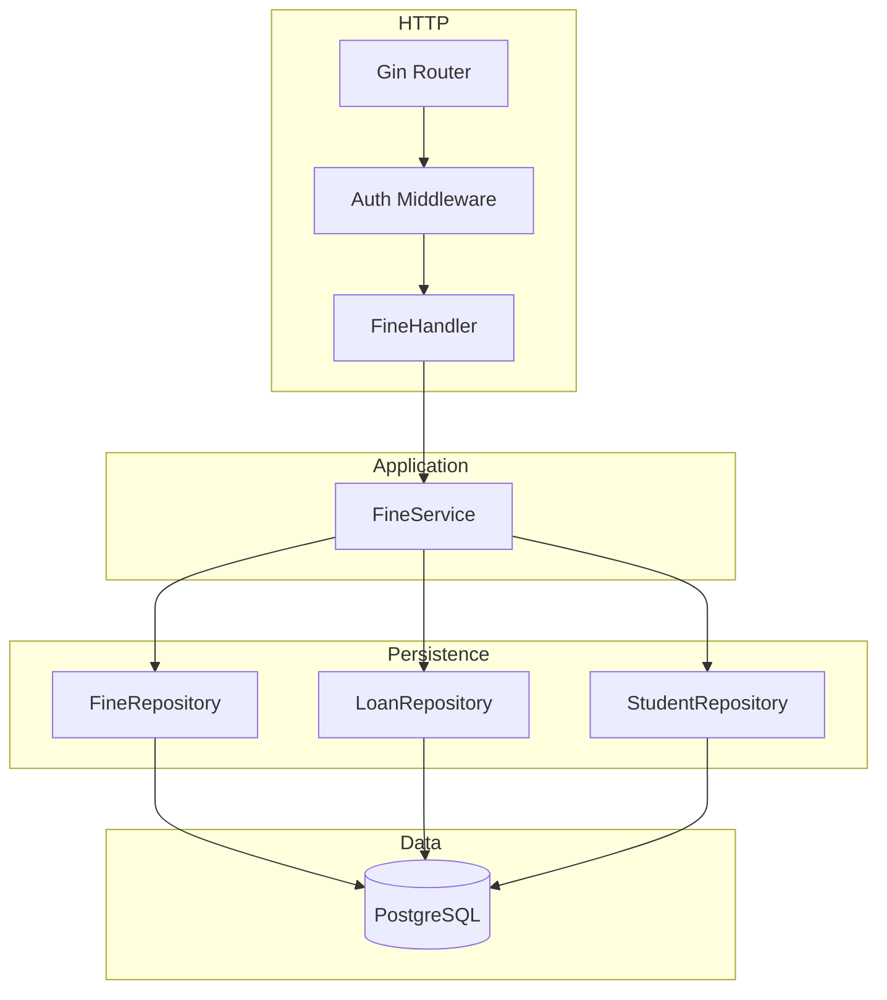
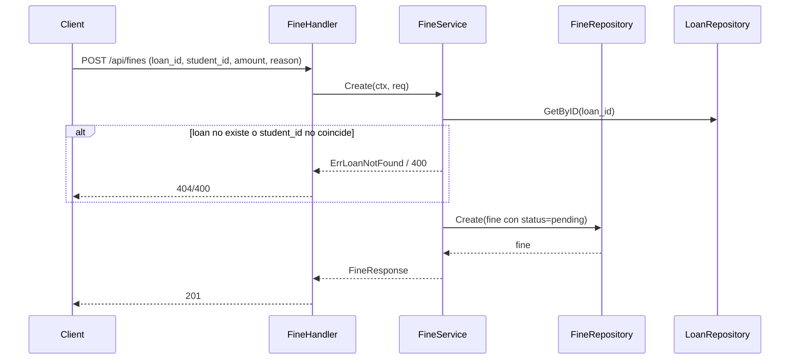
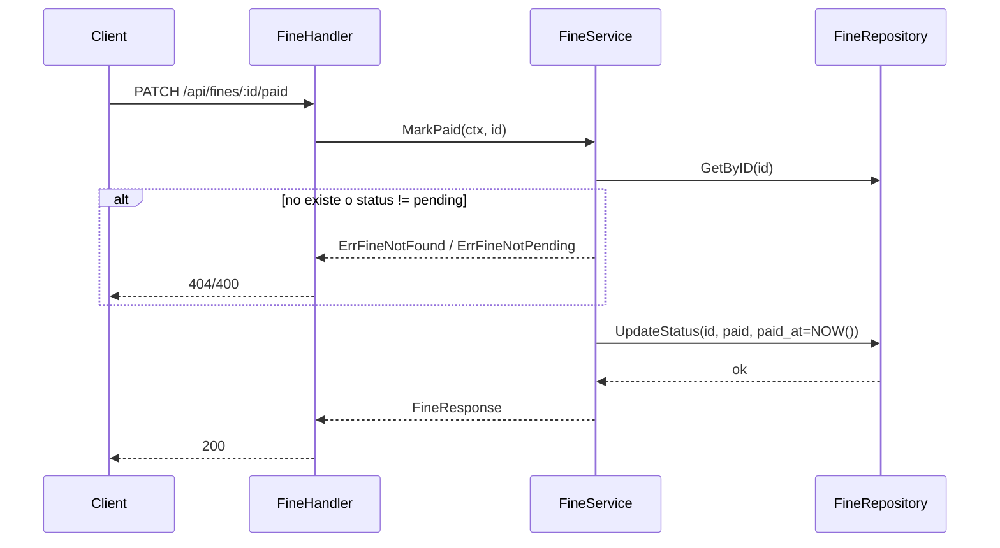

# Overview

Módulo de gestión de multas (Fines) en Go con Gin y PostgreSQL. Arquitectura en capas: **handlers** → **services** → **repositories**. Endpoints: GET listado de multas (filtros student_id, status; paginación); POST crear multa (loan_id, student_id, amount, reason); GET por ID; PATCH marcar como pagada (/api/fines/:id/paid); PATCH marcar como condonada (/api/fines/:id/waived). La tabla `fines` ya existe (loan_id, student_id, amount, status: pending | paid | waived, reason, paid_at). Al marcar como pagada se setea paid_at = NOW(). Todos los endpoints protegidos con JWT admin. La suma de amount WHERE status = 'pending' alimenta la métrica overdue_fines del dashboard de analytics.

# Architecture

## Diagrama de componentes



## Diagrama de secuencia – Crear multa



## Diagrama de secuencia – Marcar como pagada



# Components and Interfaces

## Stack

Gin, go-playground/validator/v10, pgx o database/sql, middleware JWT admin.

## Contratos API

| Método | Ruta | Descripción | Body / Query | Respuestas |
|--------|------|-------------|--------------|------------|
| GET | `/api/fines` | Listar multas | Query: student_id, status, limit, offset | 200, 401, 500 |
| POST | `/api/fines` | Crear multa | CreateFineRequest | 201, 400, 401, 404, 409, 500 |
| GET | `/api/fines/:id` | Obtener multa por ID | — | 200, 401, 404, 500 |
| PATCH | `/api/fines/:id/paid` | Marcar como pagada | — | 200, 400, 401, 404, 500 |
| PATCH | `/api/fines/:id/waived` | Marcar como condonada | — | 200, 400, 401, 404, 500 |

Paginación: limit (default 20, max 100), offset (default 0). Respuesta listado: `{ "data": [...], "total": N }`.

## DTOs

```go
// CreateFineRequest
type CreateFineRequest struct {
    LoanID   string   `json:"loan_id"   binding:"required,uuid"`
    StudentID string  `json:"student_id" binding:"required,uuid"`
    Amount   float64  `json:"amount"    binding:"required,gte=0"`
    Reason   *string  `json:"reason"    binding:"omitempty,max=500"`
}

// FineListItem
type FineListItem struct {
    ID        string   `json:"id"`
    LoanID    string   `json:"loan_id"`
    StudentID string   `json:"student_id"`
    Amount    float64  `json:"amount"`
    Status    string   `json:"status"`
    Reason    *string  `json:"reason,omitempty"`
    CreatedAt string   `json:"created_at"`
    PaidAt    *string  `json:"paid_at,omitempty"`
    StudentName *string `json:"student_name,omitempty"`
}

// FineResponse — detalle o respuesta al crear/actualizar
type FineResponse struct {
    ID        string   `json:"id"`
    LoanID    string   `json:"loan_id"`
    StudentID string   `json:"student_id"`
    Amount    float64  `json:"amount"`
    Status    string   `json:"status"`
    Reason    *string  `json:"reason,omitempty"`
    CreatedAt string   `json:"created_at"`
    PaidAt    *string  `json:"paid_at,omitempty"`
}

// ListFinesResponse
type ListFinesResponse struct {
    Data  []FineListItem `json:"data"`
    Total int64          `json:"total"`
}
```

## Interfaces de dominio

```go
// FineRepository
type FineRepository interface {
    Create(ctx context.Context, f *Fine) error
    GetByID(ctx context.Context, id string) (*Fine, error)
    List(ctx context.Context, filter FineFilter, limit, offset int) ([]FineWithStudent, int64, error)
    UpdateStatus(ctx context.Context, id string, status string, paidAt *time.Time) error
}

type FineFilter struct {
    StudentID string // optional
    Status    string // optional: pending, paid, waived
}

// FineWithStudent — resultado del repo con nombre del estudiante (JOIN)
type FineWithStudent struct {
    Fine
    StudentName string
}

// FineService
type FineService interface {
    List(ctx context.Context, filter FineFilter, limit, offset int) ([]FineListItem, int64, error)
    Create(ctx context.Context, req CreateFineRequest) (*FineResponse, error)
    GetByID(ctx context.Context, id string) (*FineResponse, error)
    MarkPaid(ctx context.Context, id string) (*FineResponse, error)
    MarkWaived(ctx context.Context, id string) (*FineResponse, error)
}
```

Errores de dominio:

```go
var (
    ErrFineNotFound    = errors.New("fine not found")
    ErrFineNotPending  = errors.New("fine is not pending (already paid or waived)")
    ErrLoanNotFound    = errors.New("loan not found")
    ErrLoanStudentMismatch = errors.New("loan does not belong to the given student")
)
```

Al crear: validar que el loan exista y que loan.student_id == req.StudentID; si no, 400 o 404.

# Data Models

## PostgreSQL

**Tabla `fines`** (existente):

| Columna   | Tipo        | Descripción |
|-----------|-------------|-------------|
| id        | UUID        | PK |
| loan_id   | UUID        | FK loans(id) ON DELETE CASCADE |
| student_id| UUID        | FK students(id) ON DELETE CASCADE |
| amount    | DECIMAL(10,2) | NOT NULL, >= 0 |
| status    | fine_status | pending \| paid \| waived |
| reason    | TEXT        | opcional |
| created_at| TIMESTAMPTZ | NOT NULL |
| paid_at   | TIMESTAMPTZ | NULL hasta status = paid |

**Listado:** SELECT con LEFT JOIN students (first_name, last_name) para student_name. WHERE por student_id y status si se envían. ORDER BY created_at DESC. LIMIT/OFFSET y COUNT.

**Crear:** INSERT (loan_id, student_id, amount, status = 'pending', reason).

**MarkPaid:** UPDATE SET status = 'paid', paid_at = NOW() WHERE id = $1 AND status = 'pending'.

**MarkWaived:** UPDATE SET status = 'waived' WHERE id = $1 AND status = 'pending'.

# Correctness Properties

### Property 1: Solo multas pending pueden marcarse como paid o waived

*For any* multa con status `paid` o `waived`, intentar MarkPaid o MarkWaived SHALL devolver error (400/404).

**Validates:** Requirements 4.2, 5.2

### Property 2: MarkPaid setea paid_at

*For any* multa marcada como pagada, paid_at SHALL ser la fecha/hora de la operación.

**Validates:** Requirement 4.1

### Property 3: Crear multa valida loan y student

*For any* creación con loan_id que no existe o cuyo student_id no coincide con req.StudentID, THE sistema SHALL rechazar y no insertar.

**Validates:** Requirement 2.2

# Error Handling

- **400:** Validación (amount < 0, loan/student mismatch). Payload: message + errors por campo.
- **401:** Sin token o token no admin.
- **404:** Multa o préstamo no encontrado.
- **409:** Opcional: multa pendiente ya existe para el mismo loan_id.
- **500:** Error interno; mensaje genérico.

# Testing Strategy

- **FineRepository:** Create, GetByID, List con filtros y paginación, UpdateStatus (paid, waived).
- **FineService:** Create (éxito, loan no existe, student no coincide); List; GetByID; MarkPaid (éxito, not found, ya paid); MarkWaived (éxito, not found, ya waived). Mocks de FineRepository, LoanRepository.
- **Handlers:** GET listado con filtros; POST crear; GET :id; PATCH paid; PATCH waived; 401 sin token.
- **Properties:** solo pending puede pasar a paid/waived; paid_at set en MarkPaid.
