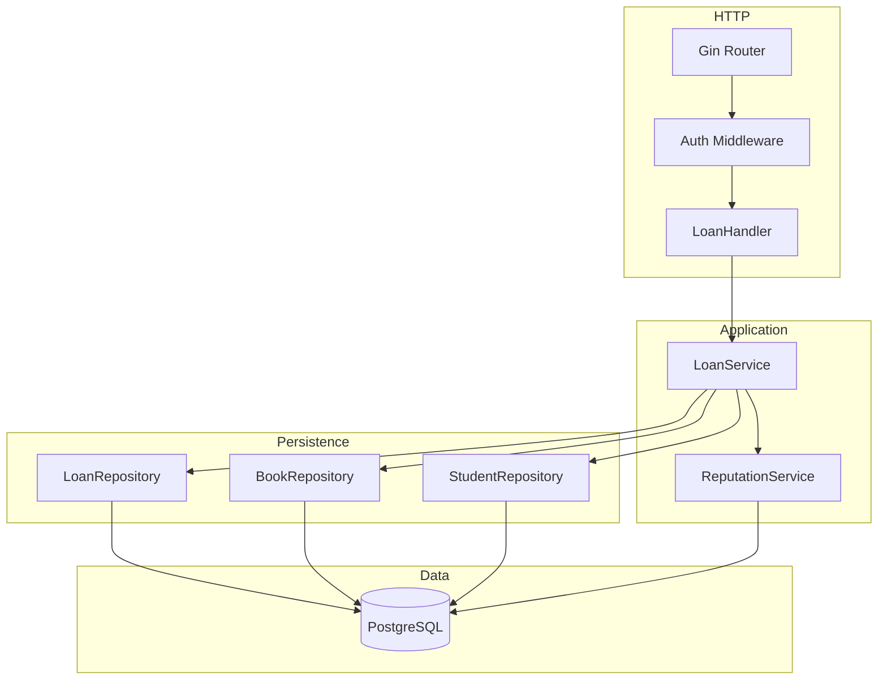
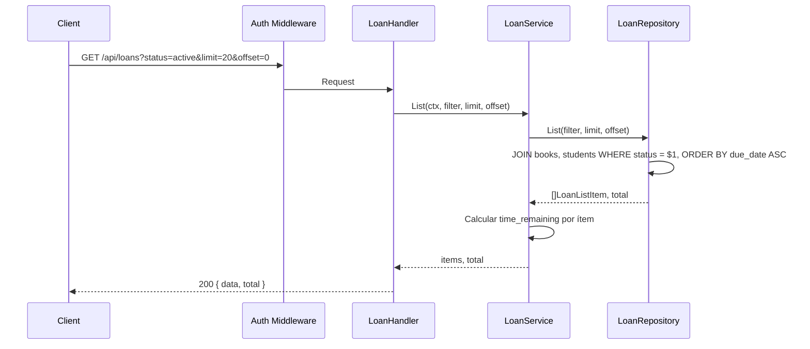
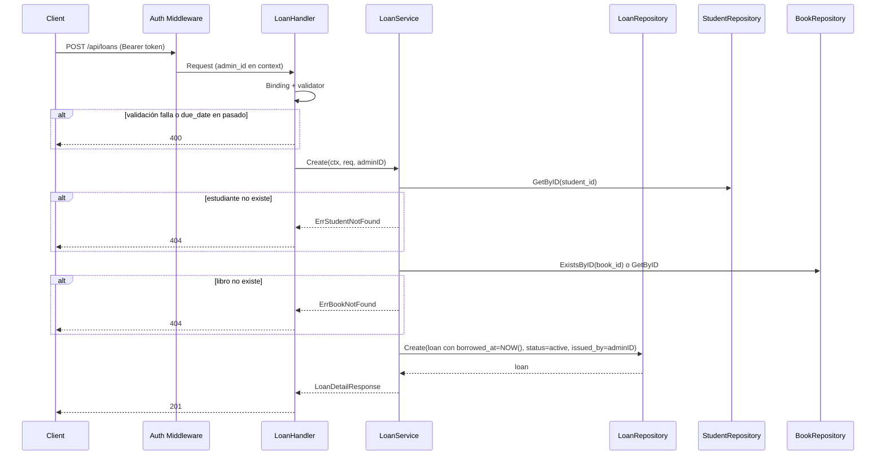

# Overview

Módulo Loan Control Panel en Go con Gin y PostgreSQL. Arquitectura en capas: **handlers** → **services** → **repositories**. Endpoints: GET listado de préstamos (book title, book id, borrower, due_date, time_remaining, isbn) con paginación y filtro opcional por status; POST crear préstamo (student_id, book_id, due_date); PATCH devolver libro (loan_id → status = returned, returned_at = NOW()). Tras una devolución exitosa, el **LoanService** invoca a **ReputationService.RecordReturn** (módulo `functionalities/reputation`) y, a continuación, **`ActivityLogRepository.Create`** para una fila `book_returned` en `activity_log` (feed del dashboard; `actor_id` = usuario JWT del handler). La tabla `loans` ya existe con book_id, student_id, issued_by, borrowed_at, due_date, returned_at, status. El servicio asigna borrowed_at = NOW(), status = 'active', issued_by desde JWT. time_remaining se calcula en servicio o en la capa de presentación (due_date - today en días). Validación: due_date >= hoy; student y book deben existir. Todos los endpoints protegidos con JWT admin.

## Bloqueo por sanción activa (integración con `sanctions`)

Antes de crear un préstamo, **LoanService** consulta `SanctionRepository.CountActiveByStudentID(student_id)`. Si el conteo es **> 0**, no se inserta el préstamo y se devuelve el error de dominio traducido a **403 Forbidden** en `LoanHandler` (mensaje orientado al operador: estudiante con sanción activa, no se registra el préstamo).

- **Dependencia de wiring:** en `main.go`, el mismo `SanctionRepository` GORM que usa el módulo de sanciones se inyecta en `loan.NewService(..., sanctionRepo)` como interfaz mínima (`CountActiveByStudentID`); los tests de préstamo pueden pasar `nil` para omitir la comprobación.
- **Levantar sanción:** al ejecutar `PATCH /api/sanctions/:id` (levantar), el estudiante vuelve a poder recibir préstamos en cuanto no quede ninguna sanción `active` a su nombre.

## Job de mora (`overdue`) y base de datos

Los préstamos no pasan solos a `overdue` en el momento exacto de medianoche salvo que exista un proceso que actualice la tabla. **Implementación elegida:** job en el **servidor de aplicación** (paquete `internal/jobs`, análogo a la limpieza de blacklist), no dependencia de `pg_cron` ni de extensiones adicionales en PostgreSQL.

- **Qué hace:** `UPDATE loans SET status = 'overdue', updated_at = NOW() WHERE status = 'active' AND due_date < CURRENT_DATE` (la comparación usa la fecha del servidor PostgreSQL).
- **Cuándo:** una vez al **arranque** del proceso y después cada **1 hora** (ajustable en `main.go`). Si se requiere granularidad menor, reducir el intervalo del ticker.
- **Errores:** solo log; el siguiente ciclo reintenta.
- **Catálogo:** la vista `book_availability` debe contar préstamos en `active` **y** `overdue` como copias prestadas; se mantiene alineada vía `EnsureBookAvailabilityView` tras `AutoMigrate` y en `migrations/001_initial_schema.sql` para quien aplique SQL a mano.

Alternativa futura: sustituir o complementar con **pg_cron** en PostgreSQL si el despliegue lo permite; el contrato de negocio (filas `active` vencidas → `overdue`) permanece igual.

# Architecture

## Diagrama de componentes



## Diagrama de secuencia – Listar préstamos



## Diagrama de secuencia – Crear préstamo



## Diagrama de secuencia – Devolver libro (con reputación)

```mermaid
sequenceDiagram
    participant C as Client
    participant H as LoanHandler
    participant S as LoanService
    participant LR as LoanRepository
    participant RS as ReputationService

    C->>H: PATCH /api/loans/:id/return
    H->>S: Return(ctx, loanID, actorUserID desde JWT)
    S->>LR: GetByID(loanID)
    alt no existe o ya returned
        S-->>H: ErrLoanNotFound / ErrLoanAlreadyReturned
        H-->>C: 404/409
    end
    S->>LR: Return(id, returned_at=NOW())
    LR-->>S: ok
    S->>RS: RecordReturn(ctx, loan con returned_at set)
    Note over RS: Crea reputation_event y actualiza student_stats
    alt error en reputación
        RS-->>S: err (loguear; no fallar devolución)
    end
    RS-->>S: nil
    S->>S: activity_log Create (book_returned; fallo → log)
    S-->>H: LoanDetailResponse
    H-->>C: 200
```

# Components and Interfaces

## Stack

Gin, go-playground/validator/v10, pgx o database/sql, middleware JWT admin. Misma arquitectura que el proyecto.

## Contratos API

| Método | Ruta | Descripción | Body / Query | Respuestas |
|--------|------|-------------|--------------|------------|
| GET | `/api/loans` | Listar préstamos (Loan Control Panel); opcional filtrar por estudiante (View All en perfil) | Query: status (opcional, default active), student_id (opcional, UUID), limit, offset | 200, 401, 500 |
| POST | `/api/loans` | Crear nuevo préstamo | CreateLoanRequest | 201, 400, 401, 404, 409, 500 |
| PATCH | `/api/loans/:id/return` | Devolver libro (registrar devolución); requiere JWT admin en contexto (actor para `activity_log`) | — | 200, 401, 404, 409, 500 |

Paginación: limit (default 20, max 100), offset (default 0). Respuesta listado: `{ "data": [...], "total": N }`.

## DTOs

```go
// CreateLoanRequest
type CreateLoanRequest struct {
    StudentID string `json:"student_id" binding:"required,uuid"`
    BookID    string `json:"book_id"    binding:"required,uuid"`
    DueDate   string `json:"due_date"   binding:"required"` // formato ISO date: YYYY-MM-DD
}

// LoanListItem — ítem del listado (panel de control)
type LoanListItem struct {
    LoanID        string `json:"loan_id"`
    BookID        string `json:"book_id"`
    BookTitle     string `json:"book_title"`
    Borrower      string `json:"borrower"`       // "FirstName LastName" o student_id_code
    DueDate       string `json:"due_date"`       // ISO date
    TimeRemaining int    `json:"time_remaining"` // días hasta due_date; 0 o negativo si venció
    ISBN          string `json:"isbn"`
    Status        string `json:"status"`         // active | returned | overdue
}

// LoanDetailResponse — respuesta al crear (o detalle de un préstamo)
type LoanDetailResponse struct {
    LoanID        string `json:"loan_id"`
    BookID        string `json:"book_id"`
    BookTitle     string `json:"book_title"`
    Borrower      string `json:"borrower"`
    BorrowedAt    string `json:"borrowed_at"`
    DueDate       string `json:"due_date"`
    TimeRemaining int    `json:"time_remaining"`
    ISBN          string `json:"isbn"`
    Status        string `json:"status"`
}

// ListLoansResponse
type ListLoansResponse struct {
    Data  []LoanListItem `json:"data"`
    Total int64          `json:"total"`
}
```

Validación adicional en servicio: DueDate debe ser >= fecha actual (parsear y comparar).

## Interfaces de dominio

```go
// LoanRepository
type LoanRepository interface {
    Create(ctx context.Context, loan *Loan) error
    GetByID(ctx context.Context, id string) (*Loan, error)
    List(ctx context.Context, filter LoanFilter, limit, offset int) ([]LoanWithDetails, int64, error)
    Return(ctx context.Context, id string, returnedAt time.Time) error // UPDATE status='returned', returned_at
}

type LoanFilter struct {
    Status    string // "active" | "returned" | "overdue" o vacío para default active
    StudentID string // opcional: filtrar por estudiante (para "View All" en perfil)
}

// LoanWithDetails — resultado del repo con datos de book y student para armar LoanListItem
type LoanWithDetails struct {
    LoanID     string
    BookID     string
    BookTitle  string
    BookISBN   string
    StudentID  string
    BorrowerName string // first_name + " " + last_name
    DueDate    time.Time
    Status     string
}

// LoanService
type LoanService interface {
    List(ctx context.Context, filter LoanFilter, limit, offset int) ([]LoanListItem, int64, error)
    Create(ctx context.Context, req CreateLoanRequest, adminID string) (*LoanDetailResponse, error)
    Return(ctx context.Context, loanID string, actorUserID string) (*LoanDetailResponse, error)
}
```

Dependencias del servicio: LoanRepository, StudentRepository, BookRepository, **ActivityLogRepository** (opcional `nil` en tests). **ReputationService:** (1) Tras **Create** préstamo exitoso, invocar `RecordLoanCreated(ctx, student_id)` para incrementar student_stats.active_loans. (2) Tras **Return** exitoso, invocar `RecordReturn(ctx, loan)` para evento y actualización de stats; si falla, loguear y no fallar la operación. (3) Tras `RecordReturn`, insertar **activity_log** (`book_returned`); si falla, loguear. (Opcional) Tras Return de un préstamo en mora, invocar a **FineService.Create** (módulo fines) para crear multa automática; si no se implementa, la multa se crea manualmente. **Contrato y capas reales** (ReputationStore, activity log, idempotencia): ver `functionalities/reputation/design.md`.

Errores de dominio:

```go
var (
    ErrLoanNotFound      = errors.New("loan not found")
    ErrLoanAlreadyReturned = errors.New("loan already returned")
    ErrStudentNotFound   = errors.New("student not found")
    ErrBookNotFound      = errors.New("book not found")
    ErrDueDateInPast     = errors.New("due_date cannot be in the past")
    ErrNoCopiesAvailable = errors.New("no copies available for loan") // opcional
)
```

# Data Models

## PostgreSQL

**Tabla `loans`** (existente en `001_initial_schema.sql`):

| Columna    | Tipo        | Descripción                          |
|------------|-------------|--------------------------------------|
| id         | UUID        | PK                                   |
| book_id    | UUID        | FK books(id)                          |
| student_id | UUID        | FK students(id)                      |
| issued_by  | UUID        | FK users(id), nullable                |
| borrowed_at| TIMESTAMPTZ | DEFAULT NOW()                        |
| due_date   | DATE        | NOT NULL                              |
| returned_at| TIMESTAMPTZ | NULL si no devuelto                  |
| status     | loan_status | active \| returned \| overdue        |
| notes      | TEXT        | opcional                              |
| created_at | TIMESTAMPTZ |                                      |
| updated_at | TIMESTAMPTZ |                                      |

**Listado:** SELECT de loans con JOIN a books (title, isbn) y students (first_name, last_name). Filtrar por status. Ordenar por due_date ASC. Calcular time_remaining en aplicación: días entre today y due_date (entero; negativo si due_date < today).

**Crear:** INSERT en loans (book_id, student_id, issued_by, borrowed_at, due_date, status = 'active').

**Devolver:** UPDATE loans SET status = 'returned', returned_at = NOW() WHERE id = $1 AND status IN ('active', 'overdue'). Si 0 filas afectadas y el préstamo existe con status = 'returned', devolver ErrLoanAlreadyReturned; si no existe, ErrLoanNotFound.

**Mora (job):** ver sección *Job de mora (`overdue`) y base de datos*.

Opcional: antes de crear, verificar que el libro tenga copias disponibles (contar loans activos por book_id vs books.total_copies). Si no hay copias, devolver 409.

## Entidades Go

```go
type Loan struct {
    ID         string     `json:"id"`
    BookID     string     `json:"book_id"`
    StudentID  string     `json:"student_id"`
    IssuedBy   *string    `json:"issued_by,omitempty"`
    BorrowedAt time.Time  `json:"borrowed_at"`
    DueDate    time.Time  `json:"due_date"` // DATE en BD
    ReturnedAt *time.Time `json:"returned_at,omitempty"`
    Status     string     `json:"status"`
    Notes      string     `json:"notes,omitempty"`
    CreatedAt  time.Time  `json:"created_at"`
    UpdatedAt  time.Time  `json:"updated_at"`
}
```

# Correctness Properties

### Property 1: due_date no en el pasado

*For any* creación de préstamo con due_date < fecha actual, el sistema SHALL rechazar con 400 y no insertar.

**Validates:** Requirement 2.3

### Property 2: Listado incluye book title, borrower, due_date, time_remaining, isbn

*For any* ítem devuelto en GET /api/loans, la respuesta SHALL contener los campos definidos en LoanListItem (loan_id, book_id, book_title, borrower, due_date, time_remaining, isbn, status).

**Validates:** Requirement 1.1

### Property 3: Crear asigna issued_by desde JWT

*For any* préstamo creado, issued_by SHALL ser el UUID del admin autenticado (extraído del JWT), no un valor enviado por el cliente.

**Validates:** Requirement 2.1

### Property 4: time_remaining coherente con due_date

*For any* ítem del listado, time_remaining SHALL ser el número de días (entero) desde hoy hasta due_date; si due_date es hoy, 0; si due_date ya pasó, negativo o 0 según implementación.

**Validates:** Requirement 1.1

### Property 5: Devolver cambia status a returned

*For any* préstamo con status active u overdue al que se aplica Return, el status SHALL cambiar a `returned` y `returned_at` SHALL tener la fecha/hora de la devolución. La copia del libro SHALL quedar disponible de nuevo (book_availability view reflejará -1 checked_out).

**Validates:** Requirement 3.1

### Property 6: No devolver dos veces

*For any* préstamo con status `returned`, un segundo intento de devolución SHALL ser rechazado (400 o 409).

**Validates:** Requirement 3.3

# Error Handling

- **400:** Validación (due_date en pasado, UUIDs inválidos, campos requeridos). Payload: message + errors por campo.
- **401:** Sin token o token no admin.
- **404:** Estudiante o libro no encontrado al crear préstamo; préstamo no encontrado al devolver.
- **409:** Opcional: no hay copias disponibles del libro; préstamo ya devuelto (o 400).
- **500:** Error interno; mensaje genérico.

# Testing Strategy

- **LoanRepository:** Create, GetByID, List con filtro status y paginación, Return (éxito, ya devuelto, no encontrado); List debe devolver datos de book y student (JOIN).
- **LoanService:** Create (éxito, student not found, book not found, due_date en pasado); List (paginación, filtro status, time_remaining calculado); Return (éxito, not found, already returned). Mocks de LoanRepository, StudentRepository, BookRepository.
- **Handlers:** GET /api/loans con token → 200 y estructura esperada; POST con body válido → 201; POST con student_id inexistente → 404; POST con due_date en pasado → 400; PATCH /api/loans/:id/return → 200 si active/overdue, 404 si no existe, 409 si ya returned; sin token → 401.
- **Properties:** due_date en pasado rechazado; listado con campos requeridos; issued_by asignado desde contexto; return cambia status; no devolver dos veces.
