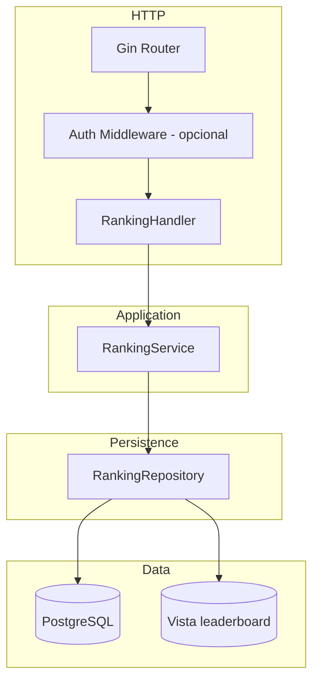
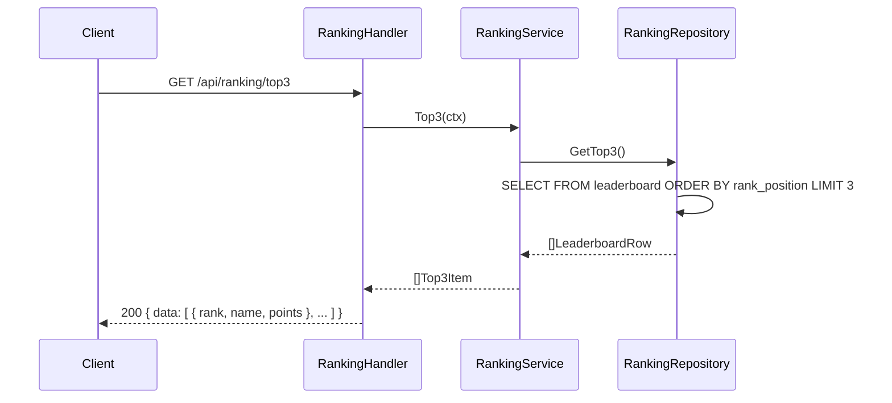
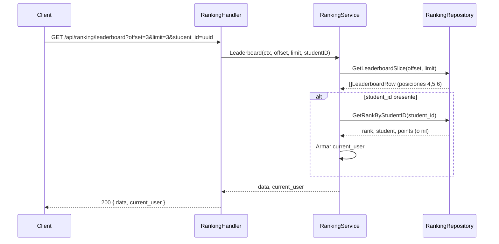

# Overview

Módulo Reputation Ranking en Go con Gin y PostgreSQL. Arquitectura en capas: **handlers** → **services** → **repositories**. Dos endpoints: (1) GET Top 3 con nombre y puntos para la sección "Top Readers"; (2) GET leaderboard con offset/limit (ej. desde posición 4, 3 elementos) y opcionalmente el puesto del estudiante actual (student_id en query). La vista `leaderboard` se crea/actualiza al arranque con `EnsureLeaderboardView` (`internal/pkg/database/postgres_prereqs.go`, invocada desde `Migrate`). El repositorio consulta la vista; el servicio expone DTOs (`Top3Item`, `LeaderboardItem`, `CurrentUserRank`). **Autenticación:** **`GET /api/ranking/top3`** y **`GET /api/ranking/leaderboard`** van en un grupo **`/api` sin middleware JWT** (públicos). El servicio de ranking usa **`StudentRepository`** para resolver `email` / `student_id_code` a UUID antes de consultar la vista `leaderboard`.

# Architecture

## Diagrama de componentes



## Diagrama de secuencia – Top 3



## Diagrama de secuencia – Leaderboard + current user



# Components and Interfaces

## Stack

Gin, pgx o database/sql, vista `leaderboard`. Misma arquitectura que el proyecto. Validación de query params (offset, limit, student_id UUID).

## Contratos API

| Método | Ruta | Descripción | Query | Respuestas |
|--------|------|-------------|--------|------------|
| GET | `/api/ranking/top3` | Top 3 del ranking (nombre, puntos) | — | 200, 500 |
| GET | `/api/ranking/leaderboard` | Tramo del leaderboard + opcional `current_user` | `offset` (def. 3), `limit` (def. 3, máx. 50); **uno solo** de: `student_id` (UUID), `email`, `student_id_code` | 200, 400, 500 |

Públicos: sin **401** por token en estas rutas.

## DTOs

```go
// Top3Item — un puesto del Top 3 (Reputation Ranking - Top Readers)
type Top3Item struct {
    Rank   int    `json:"rank"`
    Name   string `json:"name"`   // "FirstName LastName"
    Points int    `json:"points"`
    // Opcional para avatar en UI:
    StudentID  string  `json:"student_id"`
    AvatarURL  *string `json:"avatar_url,omitempty"`
}

// Top3Response
type Top3Response struct {
    Data []Top3Item `json:"data"`
}

// LeaderboardItem — una fila del Global Leaderboard
type LeaderboardItem struct {
    Rank       int     `json:"rank"`
    StudentID  string  `json:"student_id"`
    Name       string  `json:"name"`
    Points     int     `json:"points"`
    AvatarURL  *string `json:"avatar_url,omitempty"`
    BooksRead  int     `json:"books_read,omitempty"`
    StreakDays int     `json:"current_streak_days,omitempty"`
}

// CurrentUserRank — puesto del estudiante actual ("You" / "Your Rank")
type CurrentUserRank struct {
    Rank        int     `json:"rank"`
    StudentID   string  `json:"student_id"`
    Name        string  `json:"name"`
    Points      int     `json:"points"`
    BooksRead   int     `json:"books_read,omitempty"`
    StreakDays  int     `json:"current_streak_days,omitempty"`
}

// LeaderboardResponse
type LeaderboardResponse struct {
    Data        []LeaderboardItem `json:"data"`
    CurrentUser *CurrentUserRank  `json:"current_user,omitempty"` // null si no se envió student_id o no tiene puesto
}
```

## Interfaces de dominio

```go
// RankingRepository — consulta la vista leaderboard (o students + student_stats con RANK)
type RankingRepository interface {
    GetTop3(ctx context.Context) ([]LeaderboardRow, error)
    GetLeaderboardSlice(ctx context.Context, offset, limit int) ([]LeaderboardRow, error)
    GetRankByStudentID(ctx context.Context, studentID string) (*LeaderboardRow, int, error) // row y rank; error si no existe
}

// LeaderboardRow — fila cruda de la vista (o query equivalente)
type LeaderboardRow struct {
    StudentID       string
    FirstName       string
    LastName        string
    AvatarURL       *string
    TotalPoints     int
    BooksRead       int
    CurrentStreakDays int
    RankPosition    int
}

// RankingService
type RankingService interface {
    Top3(ctx context.Context) ([]Top3Item, error)
    Leaderboard(ctx context.Context, offset, limit int, studentID *string) ([]LeaderboardItem, *CurrentUserRank, error)
}
```

Implementación de GetRankByStudentID: consultar la vista leaderboard filtrando por student_id y devolver esa fila y su rank_position; si no hay fila (estudiante sin stats o inactivo), devolver (nil, 0, ErrNotFound) o similar para que el servicio ponga current_user en null.

Errores de dominio:

```go
var (
    ErrStudentNotInLeaderboard = errors.New("student not found in leaderboard") // opcional, para current_user null
)
```

# Data Models

## PostgreSQL

**Vista `leaderboard`** (existente en `001_initial_schema.sql`):

```sql
SELECT
    s.id AS student_id,
    s.first_name,
    s.last_name,
    s.avatar_url,
    ss.total_points,
    ss.total_read AS books_read,
    ss.current_streak_days,
    RANK() OVER (ORDER BY ss.total_points DESC) AS rank_position
FROM students s
JOIN student_stats ss ON ss.student_id = s.id
WHERE s.is_active = TRUE
ORDER BY ss.total_points DESC;
```

- **Top 3:** `SELECT * FROM leaderboard ORDER BY rank_position ASC LIMIT 3` (o equivalente con subquery si la vista ya ordena).
- **Tramo desde 4:** `SELECT * FROM leaderboard ORDER BY rank_position ASC OFFSET 3 LIMIT 3`.
- **Puesto por student_id:** `SELECT * FROM leaderboard WHERE student_id = $1`.

Si la vista no permite ORDER BY en subqueries en algunas versiones de PostgreSQL, el repositorio puede usar una query directa a students + student_stats con la misma expresión RANK() y filtros.

## Entidades Go

No se requiere entidad de dominio más allá de LeaderboardRow (estructura de lectura desde BD). Los DTOs (Top3Item, LeaderboardItem, CurrentUserRank) son los que expone la API.

# Correctness Properties

### Property 1: Top 3 ordenado y máximo 3

*For any* respuesta de GET /api/ranking/top3, data SHALL tener entre 0 y 3 elementos; si hay al menos uno, rank SHALL ser 1, 2, 3 en orden; points SHALL ser no crecientes (puesto 1 >= puesto 2 >= puesto 3).

**Validates:** Requirement 1.1, 1.2

### Property 2: Leaderboard tramo consistente con ranking

*For any* respuesta de GET /api/ranking/leaderboard con offset y limit, data SHALL contener hasta `limit` filas con rank consecutivos empezando en offset+1 (ej. offset=3, limit=3 → ranks 4, 5, 6). El orden por puntos SHALL ser el mismo que en Top 3 (total_points descendente).

**Validates:** Requirement 2.1, 2.5

### Property 3: current_user refleja el rank del student_id

*For any* petición con student_id válido que existe en el leaderboard, current_user SHALL contener el rank_position y total_points de ese estudiante. Si el estudiante no está en el leaderboard, current_user SHALL ser null (o no presente).

**Validates:** Requirement 2.2, 2.3

# Error Handling

- **400:** student_id con formato UUID inválido; offset/limit negativos si no se normalizan.
- **401:** Si los endpoints están protegidos, sin token o token inválido.
- **500:** Error interno; mensaje genérico.

No se devuelve 404 para "estudiante no en ranking"; se devuelve current_user null.

# Testing Strategy

- **RankingRepository:** GetTop3 (0, 1, 2, 3 registros); GetLeaderboardSlice(3, 3) devuelve posiciones 4–6; GetRankByStudentID (existente en leaderboard → rank y datos; no existente → error o nil).
- **RankingService:** Top3 mapea a Top3Item con nombre concatenado; Leaderboard con y sin student_id; current_user null cuando student_id no está en leaderboard.
- **Handlers:** GET top3 → 200 y estructura; GET leaderboard con offset/limit y con/sin student_id → 200; student_id inválido → 400; normalización de offset/limit.
- **Properties:** orden Top 3; consistencia rank en tramo; current_user coherente con student_id.
