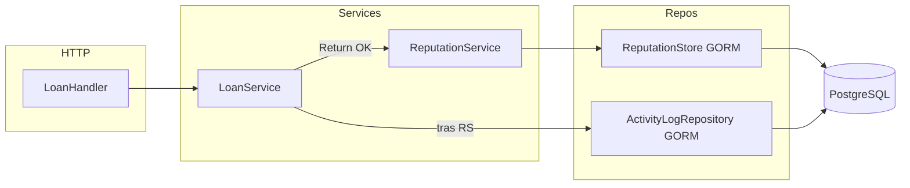

# Overview

El motor de reputación es un **servicio interno** (`internal/services/reputation`) que persiste en PostgreSQL vía **`ReputationStore`** (interfaz en `internal/repositories/reputation_store.go`, implementación GORM en `reputation_store_gorm.go`). No expone rutas HTTP propias; **LoanService** lo invoca tras crear préstamo (`RecordLoanCreated`) y tras devolver (`RecordReturn`). Los errores de reputación **no** revierten el préstamo: se registran con `log.Printf`.

El **feed de actividad** (`activity_log` en devolución) lo escribe **LoanService** (no `ReputationService`), vía **`ActivityLogRepository`** (`activity_log_repository.go` + `activity_log_repository_gorm.go`), tras `RecordReturn` y con el mismo criterio de “a tiempo” en metadatos (día calendario UTC).

# As-built: capas y archivos

| Capa | Archivo(s) | Rol |
|------|------------|-----|
| Servicio | `internal/services/reputation/reputation_service.go` | `RecordLoanCreated`, `RecordReturn`; reglas de puntos y “a tiempo” (día UTC); delegación al store. |
| Contrato persistencia | `internal/repositories/reputation_store.go` | `ReputationStore`. |
| Implementación | `internal/repositories/reputation_store_gorm.go` | GORM: idempotencia devolución, `CreateReputationEvent`, `IncrementStudentActiveLoans`, `ApplyStudentReturn`. |
| Activity feed | `internal/repositories/activity_log_repository.go`, `activity_log_repository_gorm.go` | `Create` en `activity_log` (usado desde préstamos). |
| Modelos | `internal/models/reputation_event.go`, `student_stats.go`, `reputation_event_type.go`, `activity_log.go` | Entidades y enum. |
| Integración préstamo | `internal/services/loan/loan_service.go` | `reputationHook` + `ActivityLogRepository`; `Return(ctx, loanID, actorUserID)`. |
| Wiring | `main.go` | `ReputationStore`, `ReputationService`, `ActivityLogRepository` GORM → `loan.NewService`. |

# Diagrama (as-built)



# ReputationStore (contrato)

```go
// Ver reputation_store.go
type ReputationStore interface {
    ExistsReturnEventForLoan(ctx context.Context, loanID string) (bool, error)
    CreateReputationEvent(ctx context.Context, ev *models.ReputationEvent) error
    IncrementStudentActiveLoans(ctx context.Context, studentID string, delta int) error
    ApplyStudentReturn(ctx context.Context, studentID string, points int, onTime bool) error
}
```

# Flujo RecordReturn

1. **LoanService** persiste préstamo `returned` + `returned_at`.
2. **ReputationService.RecordReturn** valida status y fechas; calcula on-time comparando **día calendario UTC** de `due_date` vs `returned_at`.
3. **ExistsReturnEventForLoan:** si ya hay evento de devolución con `reference_id = loan.id`, retorna sin escribir.
4. **CreateReputationEvent** + **ApplyStudentReturn** (stats: lecturas, puntos, racha, `overdue_count` si tarde).

# Flujo activity_log (devolución)

1. Tras **RecordReturn** (éxitos o no-op interno de reputación ya resuelto en el servicio de reputación), **LoanService** llama a `logBookReturned` si `activityLog != nil`.
2. Inserta `event_type` = `book_returned`, `student_id`, `actor_id` (staff JWT), `metadata` con `loan_id`, `book_id`, `returned_on_time`, `returned_at_rfc3339`.
3. Fallo de insert → `log.Printf`; la respuesta HTTP de devolución sigue siendo 200 con detalle del préstamo.

# Flujo RecordLoanCreated

1. Tras INSERT de préstamo exitoso, **IncrementStudentActiveLoans** con `delta = 1`.
2. No se inserta fila en `reputation_events` en este flujo.

# Decisiones de diseño

| Decisión | Motivo |
|----------|--------|
| **Un solo `ReputationStore`** | Menos superficie; flujo claro para eventos + stats. |
| **Activity log en LoanService** | Feed transversal del dashboard; no mezclar con puntos/racha de reputación. |
| **Errores secundarios no bloquean préstamo** | UX: devolución ya persistida. |
| **Idempotencia solo en reputación (devolución)** | Evita doble conteo de puntos; `activity_log` se escribe una vez por `Return` HTTP exitoso (re-devolución devuelve 409 antes). |
| **`Return(loanID, actorUserID)`** | `actor_id` en `activity_log` requiere identidad del staff (JWT). |

# Extensiones (diseño futuro)

- **Fine / sanction / badge:** nuevas entradas en `reputation_events` y/o `activity_log` desde otros servicios si el producto lo define.
