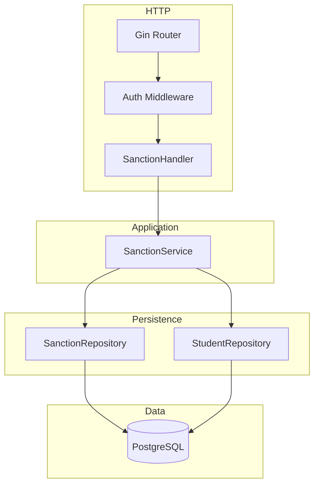
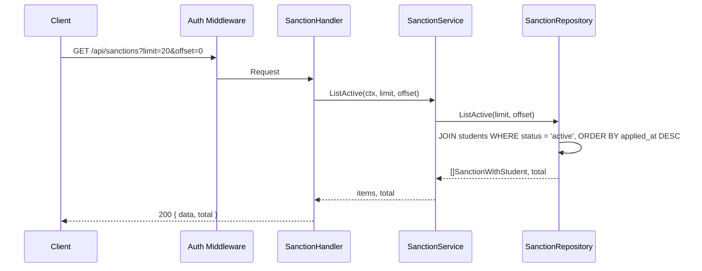
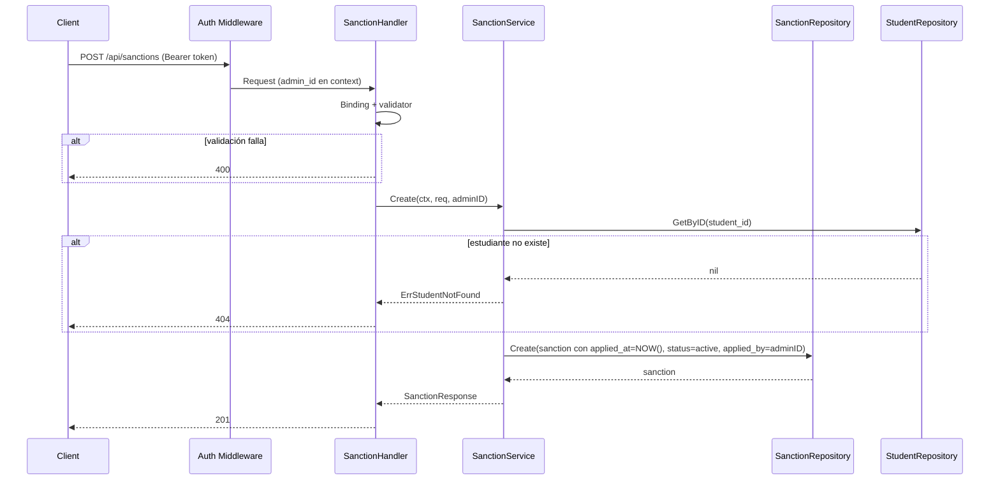
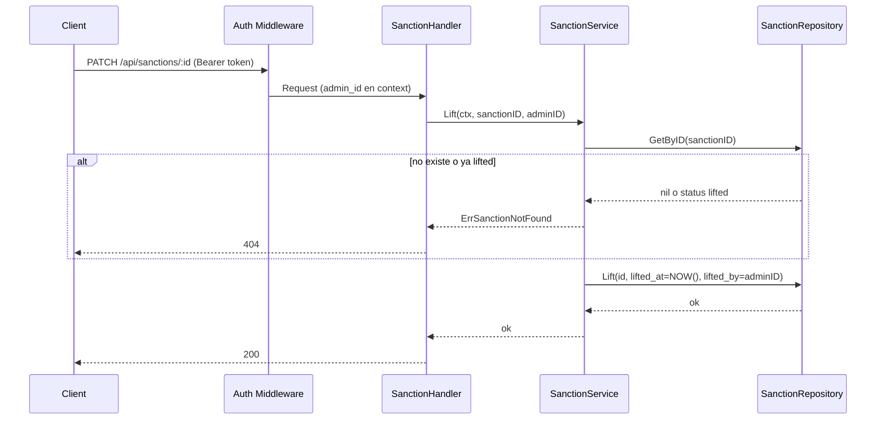

# Overview

Módulo de gestión de sanciones en Go con Gin y PostgreSQL. Arquitectura en capas: **handlers** → **services** → **repositories**. Endpoints: GET listado de estudiantes sancionados (sanciones activas con datos del estudiante); POST crear sanción (student_id, reason); PATCH levantar sanción (sanction id → status = lifted). La tabla `sanctions` ya existe con student_id, reason, status (active | lifted), applied_at, applied_by, lifted_at, lifted_by. El servicio asigna applied_at = NOW(), applied_by desde JWT al crear; al levantar, lifted_at = NOW(), lifted_by desde JWT. Todos los endpoints protegidos con JWT admin.

# Architecture

## Diagrama de componentes



## Diagrama de secuencia – Listar sancionados



## Diagrama de secuencia – Crear sanción



## Diagrama de secuencia – Levantar sanción



# Components and Interfaces

## Stack

Gin, go-playground/validator/v10, pgx o database/sql, middleware JWT admin. Misma arquitectura que el proyecto.

## Contratos API

| Método | Ruta | Descripción | Body / Query | Respuestas |
|--------|------|-------------|--------------|------------|
| GET | `/api/sanctions` | Listar estudiantes sancionados (sanciones activas) | Query: limit, offset | 200, 401, 500 |
| POST | `/api/sanctions` | Agregar estudiante a sanciones (crear sanción) | CreateSanctionRequest | 201, 400, 401, 404, 409, 500 |
| PATCH | `/api/sanctions/:id` | Levantar sanción (quitar de lista de sancionados) | LiftSanctionRequest (opcional: solo status) | 200, 401, 404, 500 |

Paginación: limit (default 20, max 100), offset (default 0). Respuesta listado: `{ "data": [...], "total": N }`.

Criterio de negocio: se permite más de una sanción activa por estudiante; el listado muestra todas las sanciones activas (cada fila = una sanción con datos del estudiante). Si se desea una sola sanción activa por estudiante, validar en servicio y devolver 409.

## DTOs

```go
// CreateSanctionRequest
type CreateSanctionRequest struct {
    StudentID string `json:"student_id" binding:"required,uuid"`
    Reason    string `json:"reason"      binding:"required,min=1,max=2000"`
}

// SanctionListItem — ítem del listado (estudiante sancionado + sanción)
type SanctionListItem struct {
    SanctionID  string  `json:"sanction_id"`
    StudentID   string  `json:"student_id"`
    StudentIDCode string `json:"student_id_code"`
    FirstName   string  `json:"first_name"`
    LastName    string  `json:"last_name"`
    Email       *string `json:"email,omitempty"`
    Reason      string  `json:"reason"`
    AppliedAt   string  `json:"applied_at"`   // ISO timestamp
    AppliedByID *string `json:"applied_by_id,omitempty"`
}

// SanctionResponse — respuesta al crear (o detalle)
type SanctionResponse struct {
    SanctionID  string  `json:"sanction_id"`
    StudentID   string  `json:"student_id"`
    StudentIDCode string `json:"student_id_code"`
    FirstName   string  `json:"first_name"`
    LastName    string  `json:"last_name"`
    Reason      string  `json:"reason"`
    Status      string  `json:"status"`
    AppliedAt   string  `json:"applied_at"`
    AppliedByID *string `json:"applied_by_id,omitempty"`
}

// LiftSanctionRequest — opcional si se usa PATCH con body; si solo se permite levantar, puede ser vacío o { "status": "lifted" }
type LiftSanctionRequest struct {
    Status string `json:"status" binding:"omitempty,oneof=lifted"`
}

// ListSanctionsResponse
type ListSanctionsResponse struct {
    Data  []SanctionListItem `json:"data"`
    Total int64              `json:"total"`
}
```

## Interfaces de dominio

```go
// SanctionRepository
type SanctionRepository interface {
    Create(ctx context.Context, s *Sanction) error
    GetByID(ctx context.Context, id string) (*Sanction, error)
    ListActive(ctx context.Context, limit, offset int) ([]SanctionWithStudent, int64, error)
    Lift(ctx context.Context, id string, liftedAt time.Time, liftedBy string) error
}

// SanctionWithStudent — resultado del repo con datos del estudiante para listado
type SanctionWithStudent struct {
    SanctionID   string
    StudentID    string
    StudentIDCode string
    FirstName    string
    LastName     string
    Email        *string
    Reason       string
    Status       string
    AppliedAt    time.Time
    AppliedByID  *string
}

// SanctionService
type SanctionService interface {
    ListActive(ctx context.Context, limit, offset int) ([]SanctionListItem, int64, error)
    Create(ctx context.Context, req CreateSanctionRequest, adminID string) (*SanctionResponse, error)
    Lift(ctx context.Context, sanctionID string, adminID string) error
}
```

Errores de dominio:

```go
var (
    ErrSanctionNotFound = errors.New("sanction not found")
    ErrStudentNotFound  = errors.New("student not found")
    ErrSanctionAlreadyLifted = errors.New("sanction already lifted")
)
```

Dependencias del servicio: SanctionRepository, StudentRepository (GetByID para validar que el estudiante exista al crear).

# Data Models

## PostgreSQL

**Tabla `sanctions`** (existente en `001_initial_schema.sql`):

| Columna   | Tipo        | Descripción                          |
|-----------|-------------|--------------------------------------|
| id        | UUID        | PK                                   |
| student_id| UUID        | FK students(id) ON DELETE CASCADE   |
| reason    | TEXT        | NOT NULL                             |
| status    | sanction_status | active \| lifted, DEFAULT 'active' |
| applied_at| TIMESTAMPTZ | NOT NULL, DEFAULT NOW()             |
| applied_by| UUID        | FK users(id), nullable               |
| lifted_at | TIMESTAMPTZ | NULL hasta que se levante           |
| lifted_by | UUID        | FK users(id), nullable               |
| created_at| TIMESTAMPTZ | NOT NULL                            |

**Listado:** SELECT de sanctions con JOIN a students (id, student_id_code, first_name, last_name, email). WHERE status = 'active'. ORDER BY applied_at DESC. LIMIT/OFFSET y COUNT.

**Crear:** INSERT (student_id, reason, status = 'active', applied_at = NOW(), applied_by = adminID).

**Levantar:** UPDATE sanctions SET status = 'lifted', lifted_at = NOW(), lifted_by = adminID WHERE id = $1 AND status = 'active'. Si no se actualiza ninguna fila, devolver 404.

## Entidades Go

```go
type Sanction struct {
    ID         string     `json:"id"`
    StudentID  string     `json:"student_id"`
    Reason     string     `json:"reason"`
    Status     string     `json:"status"`
    AppliedAt  time.Time  `json:"applied_at"`
    AppliedBy  *string    `json:"applied_by,omitempty"`
    LiftedAt   *time.Time `json:"lifted_at,omitempty"`
    LiftedBy   *string    `json:"lifted_by,omitempty"`
    CreatedAt  time.Time  `json:"created_at"`
}
```

# Correctness Properties

### Property 1: Listado solo sanciones activas

*For any* ítem devuelto en GET /api/sanctions, la sanción SHALL tener status `active`.

**Validates:** Requirement 1.1

### Property 2: applied_by asignado desde JWT al crear

*For any* sanción creada, applied_by SHALL ser el UUID del admin autenticado (extraído del JWT), no un valor enviado por el cliente.

**Validates:** Requirement 2.1

### Property 3: Levantar asigna lifted_by desde JWT

*For any* sanción levantada, lifted_by SHALL ser el UUID del admin autenticado y lifted_at SHALL ser la fecha/hora del levantamiento.

**Validates:** Requirement 3.1

### Property 4: Sanción ya lifted no se puede levantar de nuevo

*For any* petición de levantar una sanción cuyo status es ya `lifted`, THE sistema SHALL responder 404 y no modificar el registro.

**Validates:** Requirement 3.2

# Integración con préstamos (`loan`)

- **Regla:** mientras exista al menos una sanción **`active`** para un `student_id`, **POST /api/loans** con ese estudiante debe responder **403 Forbidden** (implementado en `LoanService.Create` vía `SanctionRepository.CountActiveByStudentID`, inyección en `main.go`).
- **Levantar sanción:** `PATCH /api/sanctions/:id` pasa la sanción a `lifted`; si no quedan sanciones activas para el estudiante, vuelve a poder recibir préstamos.
- **Documentación:** ver `functionalities/loan/design.md` (sección “Bloqueo por sanción activa”) y `functionalities/loan/requirements.md` (criterio 7 en crear préstamo).

# Error Handling

- **400:** Validación (reason vacío, student_id formato inválido). Payload: message + errors por campo.
- **401:** Sin token o token no admin.
- **404:** Estudiante no encontrado al crear; sanción no encontrada o ya lifted al levantar.
- **409:** Opcional: estudiante ya tiene sanción activa si se decide una sola sanción activa por estudiante.
- **500:** Error interno; mensaje genérico.

# Testing Strategy

- **SanctionRepository:** Create, GetByID (existente activo, existente lifted, no existente), ListActive (paginación, solo status active, JOIN student), Lift (éxito, id inexistente, ya lifted).
- **SanctionService:** Create (éxito, student not found); ListActive (paginación, mapeo a SanctionListItem); Lift (éxito, sanction not found, already lifted). Mocks de SanctionRepository y StudentRepository.
- **Handlers:** GET /api/sanctions con token → 200 y estructura; POST con body válido → 201; POST student_id inexistente → 404; PATCH id inexistente o lifted → 404; sin token → 401.
- **Properties:** applied_by y lifted_by asignados desde contexto; listado solo activos; no levantar dos veces.
